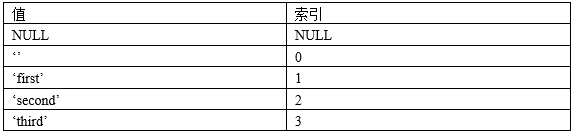
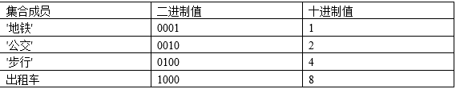
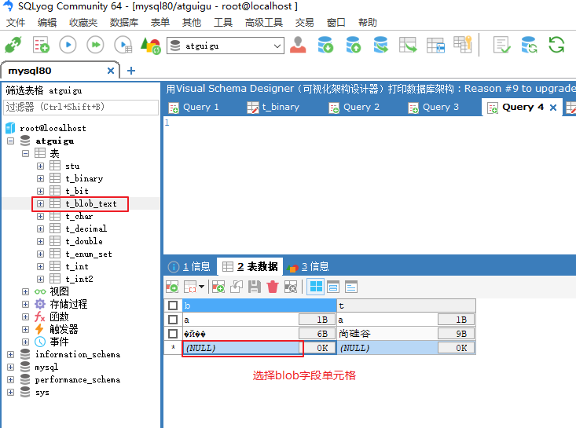
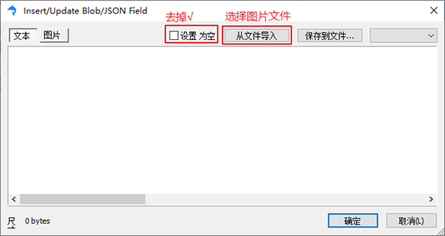
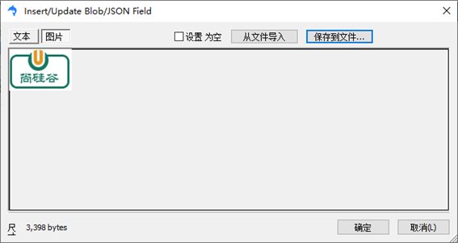
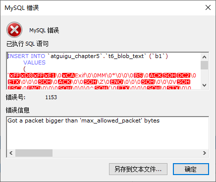
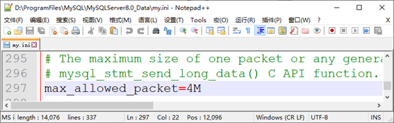

# 01mysql_base

# 1. 数据库相关概念

## 1）数据库是什么？

​				存储数据的地方

​				DB：数据库（Database）

## 2）为什么要用数据库？

​			1. 前面我们都是使用数组和集合容器进行存储数据，但是都是内存中操作数据的，弊端是什么？

​					内存中操作数据，如果程序退出或断电，数据就会消失

​			2. 为什么不适用文件持久化存储数据而是使用数据库持久化存储？

​					把数据写入到硬盘上的文件中，可以实现持久化存储数据，但是不利于后期的检索和管理等

## 3）MySQL、Oracle、SqlServer是什么？

​				MySQL、Oracle、SqlServer都是数据库管理系统（DBMS，Database Management System）

​				是一种操纵和管理数据库的大型软件，例如建立、使用和维护数据库。

## 4）相关图


# 2. 数据库管理系统

## 	1. 什么是关系型数据库和非关系数据库？

​			MySQL、Oracle、SqlServer等是关系型数据库管理系统

​			MongoDB、Redis、Elasticsearch等是非关系型数据库管理系统

​			关系型数据库：采用关系模型来组织数据，简单来说，关系模型指的就是二维表格模型，类似于Excel工作表

​			非关系型数据库：可看成传统关系型数据库的功能阉割版本，基于键值对存储数据，通过减少很少用的功能，来提高性能

## 	2. 查看数据库最新排名

​			查看数据库最新排名：https://db-engines.com/en/ranking

​			目前主流的关系型数据库管理系统的市场占有率排名如下：


### 	1. Oracle

​		Oracle：大型的收费数据库，Oracle公司产品，价格昂贵

### 	2. MySQL

​			MySQL：开源免费的中小型数据库，后来Sun公司收购了MySQL，而Oracle又收购了Sun公司。目前Oracle推出了收费版本的			MySQL，也提供了免费的社区版本。

### 	3. SQL Server		

​			SQL Server：Microsoft 公司推出的收费的中型数据库，C#、.net等语言常用

### 	4. PostgreSQL

​			PostgreSQL：开源免费的中小型数据库。DB2：IBM公司的大型收费数据库产品

### 	5. SQLLite		

​			SQLLite：嵌入式的微型数据库。Android内置的数据库采用的就是该数据库

### 	6. MariaDB

​			MariaDB：开源免费的中小型数据库。是MySQL数据库的另外一个分支、另外一个衍生产品，与MySQL数据库有很好的兼容性

# 3. 关系型数据库的通用性

​		无论使用哪一种关系型数据库，操作时，都是使用SQL语言来进行统一操作

​		SQL语言是操作关系型数据库的统一标准，即使到了公司，使用别的关系型数据库，

​		如：Oracle、DB2、SQLServer，操作方式都是一致性的，就相当于学了MySQL的SQL语法，

​		其他关系型数据库上手也很快，因为类似操作，只是不同关系型数据库可能存在细小差别的SQL方言！

# 4. 关系型数据库MySQL

## 	1. 版本

​		官方： https://www.mysql.com/

​		针对不同用户，MySQL提供三个不同的版本。

​			1）MySQL Enterprise Server（企业版）：

​				能够以更高的性价比为企业提供数据仓库应用，该版本需要付费使用，官方提供电话技术支持。	

​			2）MySQL Cluster（集群版）：

​				MySQL 集群是 MySQL 适合于分布式计算环境的高可用、高冗余版本

​				它采用了 NDB Cluster 存储引擎，允许在 1 个集群中运行多个 MySQL 服务器

​				它不能单独使用，需要在社区版或企业版基础上使用

​			3）MySQL Community Server（社区版）：

​					在开源GPL许可证之下可以自由的使用。该版本完全免费，但是官方不提供技术支持

​			MySQL5.7（RC）是当前稳定的发布系列

​			MySQL8.0.26（GA）是最新开发的稳定发布系列

​			下载地址：https://downloads.mysql.com/archives/installer/

## 3. 安装

​		查阅安装文档

## 4. 配置

​		查阅安装文档

## 5. 启动停止（管理员身份）

​		MySQL安装完成之后，我们一般将Mysql服务设置为自动启动，当然也可以手动启动，如下：

### 	1. mysql服务停止

​			net stop mysql服务名（忘了服务名的可以去系统服务列表查看）

```
	例如：net stop mysql80
```

### 	2. mysql服务启动

​			net start mysql服务名（忘了服务名的可以去系统服务列表查看）

```
	例如：net start mysql80
```


## 6. 客户端连接

### 	1. 方式一

​		方式一：使用MySQL提供的客户端命令行工具

​		

### 	2. 方式二

​		方式二：使用系统自带的命令行工具执行指令

​		

```
mysql [-h 127.0.0.1] [-P 3306] -u root -p
	参数： 
		-h : MySQL服务所在的主机IP 
		-P : MySQL服务端口号， 默认3306 
		-u : MySQL数据库用户名 
		-p ： MySQL数据库用户名对应的密码
		
[]内为可选参数，如果需要连接远程的MySQL，需要加上这两个参数来指定远程主机IP、端口，如果连接本地的MySQL，则无需指定这两个参数

例如：
	mysql -h localhost -P 3306 -u root -p
	Enter password:roo
	
注意： 使用这种方式进行连接时，需要安装完毕后配置PATH环境变量
```

# 5. 数据模型

## 	1. 关系型数据库（RDBMS）

```
1. 关系型数据库
	关系型数据库指的是多张相互连接的二维表组成的数据库
2. 二维表
	二维表指的是由行和列组成的表
	例如：MySQL、Oracle、DB2、SQLServer这些都属于关系型数据库，里面都是基于二维表存储数据
	简单说，基于二维表存储数据的数据库就是关系型数据库，不是基于二维表存储数据的数据库就是非关系型数据库。
3. 特点
	 1. 使用表存储数据，格式统一，便于维护
	 2. 使用SQL语言操作，标准统一，使用方便
4. 如下典型的二维表结构：（体现出二维表的特点）
```


## 	2. 数据模型

​		

```
1. MySQL客户端连接数据库管理系统DBMS，然后通过DBMS操作数据库
2. SQL语句通过数据库管理系统操作数据库，以及操作数据库中的表结构及数据
3.一个数据库服务器中可以创建多个数据库，一个数据库中也可以包含多张表，而一张表中又可以包含多行记录
```

# 6. MySQL主要优势

​		1. 可移植性：MySQL数据库几乎支持所有的操作系统，如Linux、Solaris、FreeBSD、Mac和Windows

​		2. 免费：

​		3. 开源：

​		4. 关系型数据库：MySQL可以利用标准SQL语法进行查询和操作。

​		5. 速度快、体积小、容易使用：与其他大型数据库的设置和管理相比，其复杂程度较低，易于学习

​						MySQL的早期版本（主要使用的是MyISAM引擎）在高并发下显得有些力不从心

​						随着版本的升级优化（主要使用的是InnoDB引擎）

​		6. 安全性和连接性：十分灵活和安全的权限和密码系统，允许基于主机的验证

​											连接到服务器时，所有的密码传输均采用加密形式，从而保证了密码安全

​		7. 丰富的接口：提供了用于C、C++、Java、PHP、Python、Ruby和Eiffel、Perl等语言的API

​		8. 灵活：MySQL并不完美，但是却足够灵活，能够适应高要求的环境

​						同时，MySQL既可以嵌入到应用程序中，

​						也可以支持数据仓库、内容索引和部署软件、高可用的冗余系统、在线事务处理系统等各种应用类型

​		9. MySQL最重要、最与众不同的特性是它的存储引擎架构，这种架构的设计将查询处理（Query Processing）及其他系统任务

​				这种处理和存储分离的设计可以在使用时根据性能、特性，以及其他需求来选择数据存储的方式

​				MySQL中同一个数据库，不同的表格可以选择不同的存储引擎

​				其中使用最多的是InnoDB 和MyISAM，MySQL5.5之后InnoDB是默认的存储引擎

# 7. MySQL支持的数据类型

## 	1. 数值类型

```
数值类型主要用来存储数字，不同的数值类型提供不同的取值范围，可以存储的值范围越大，所需要的存储空间也越大

MySQL支持所有标准SQL中的数值类型
其中包括
严格数据类型（INTEGER、SMALLINT、DECIMAL、NUMERIC）
和
近似数值类型（FLOAT、REAL、DOUBLE PRECISION）

MySQL还扩展了TINYINT、MEDIUMINT和BIGINT等3种不同长度的整数类型，并增加了BIT类型，用来存储位数据。

对于MySQL中的数值类型，还要做如下说明：
	1. 关键字INT是INTEGER的同义词。
	2. 关键字DEC和FIXED是DECIMAL的同义词。
	3. NUMERIC和DECIMAL类型被视为相同的数据类型。
	4. DOUBLE视为DOUBLE PRECISION的同义词，
		并在REAL_AS_FLOAT SQL模式未启用的情况下，将REAL也视为DOUBLE PRECISION的同义词
```

### 1. 整数类型

```
说明：
对于整数类型，MySQL还支持在类型名称后面加小括号(M)，
而小括号中的M表示显示宽度，M的取值范围是(0, 255)

int(M)这个M在字段的属性中指定了unsigned（无符号）和zerofill（零填充）的情况下才有意义

表示当整数值不够M位时，用0填充
如果整数值超过M位但是没有超过当前数据类型的范围时，就按照实际位数存储

当M宽度超过当前数据类型可存储数值范围的最大宽度时，也是以实际存储范围为准。

MySQL8之前，int没有指定(M)，默认显示(11),最多能存储和显示11位整数

从MySQL 8.0.17开始，整数数据类型不推荐使用显示宽度属性，默认显示int
```

```mysql
#演示整数类型
#创建一个表格，表格的名称“t_int”，
#包含两个字段i1和i2，分别是int和int(2)类型
#create table t_int(i1 int,i2 int(2));
create table t_int(
	i1 int,
	i2 int(2)  #没有unsigned zerofill，(2)没有意义
);

#查看当前数据库的所有表格
show tables;
show tables from 数据库名;

#查看表结构
desc 表名称;
desc t_int;

mysql> desc t_int;
+-------+------+------+-----+---------+-------+
| Field | Type | Null | Key | Default | Extra |
+-------+------+------+-----+---------+-------+
| i1    | int  | YES  |     | NULL    |       |
| i2    | int  | YES  |     | NULL    |       |
+-------+------+------+-----+---------+-------+
2 rows in set (0.01 sec)

#创建一个表格，表格的名称“t_int2”，
#包含两个字段i1和i2，分别是int和int(2)类型
create table t_int2(
	i1 int,
	i2 int(2) unsigned zerofill
);

mysql> desc t_int2;
+-------+--------------------------+------+-----+---------+-------+
| Field | Type                     | Null | Key | Default | Extra |
+-------+--------------------------+------+-----+---------+-------+
| i1    | int                      | YES  |     | NULL    |       |
| i2    | int(2) unsigned zerofill | YES  |     | NULL    |       |
+-------+--------------------------+------+-----+---------+-------+
2 rows in set (0.01 sec)

#添加数据到表格中
insert into 表名称 values(值列表);
insert into t_int values(1234,1234);
insert into t_int2 values(1234,1234);

#查询数据
select * from 表名称;
select * from t_int;
select * from t_int2;

#添加数据到表格中
insert into 表名称 values(值列表);
insert into t_int values(1,1);
insert into t_int2 values(1,1);

insert into t_int values(12222228854225548778455,12222228854225548778455);
mysql> insert into t_int values(12222228854225548778455,12222228854225548778455);
ERROR 1264 (22003): Out of range value for column 'i1' at row 

```

### 2. bit类型

```
bit类型，如果没有指定(M)，默认是1位

这个1位，那么表示只能存1位的二进制值

这里(M)是表示二进制的位数。M范围从1到64。

对于位类型字段，之前版本直接使用SELECT语句将不会看到结果，
而在MySQL8版本中默认以“0X”开头的十六进制形式显示，可以通过BIN()函数显示为二进制格式
```


```mysql
#演示bit类型，存储二进制，只有0和1
#创建一个表格
create table t_bit(
	b1 bit,  #没有指定(M)，默认是1位二进制
	b2 bit(4) #能够存储4位二进制0000~1111
);

#查看表结构
desc t_bit;

mysql> desc t_bit;
+-------+--------+------+-----+---------+-------+
| Field | Type   | Null | Key | Default | Extra |
+-------+--------+------+-----+---------+-------+
| b1    | bit(1) | YES  |     | NULL    |       |
| b2    | bit(4) | YES  |     | NULL    |       |
+-------+--------+------+-----+---------+-------+
2 rows in set (0.01 sec)

#添加记录
insert into t_bit values(1,1);

#查看数据
select * from t_bit;

mysql> select * from t_bit;
+------------+------------+
| b1         | b2         |
+------------+------------+
| 0x01       | 0x01       |  #0x开头表示十六进制
+------------+------------+
1 row in set (0.00 sec)

#显示二进制值，需要使用bin函数
select bin(b1),bin(b2) from t_bit;

mysql> select bin(b1),bin(b2) from t_bit;
+---------+---------+
| bin(b1) | bin(b2) |
+---------+---------+
| 1       | 1       |
+---------+---------+
1 row in set (0.00 sec)

#添加记录
insert into t_bit values(2,2);

mysql> insert into t_bit values(2,2); 
#values()中是十进制值，需要转为二进制存储，2对应10，超过1位，b1存不下
ERROR 1406 (22001): Data too long for column 'b1' at row 1

#添加记录
insert into t_bit values(1,8);

#查看数据
select * from t_bit;

mysql> select * from t_bit;
+------------+------------+
| b1         | b2         |
+------------+------------+
| 0x01       | 0x01       |
| 0x01       | 0x08       |
+------------+------------+
2 rows in set (0.00 sec)


#显示二进制值，需要使用bin函数
select bin(b1),bin(b2) from t_bit;

mysql> select bin(b1),bin(b2) from t_bit;
+---------+---------+
| bin(b1) | bin(b2) |
+---------+---------+
| 1       | 1       |
| 1       | 1000    |
+---------+---------+
2 rows in set (0.00 sec)

#添加记录
insert into t_bit values(1,16); #16的二进制10000
mysql> insert into t_bit values(1,16);
ERROR 1406 (22001): Data too long for column 'b2' at row 1
```

### 3. 小数类型

```
MySQL中使用浮点数和定点数来表示小数

浮点数有两种类型：
	单精度浮点数（FLOAT）和双精度浮点数（DOUBLE），定点数只有DECIMAL
	浮点数和定点数都可以用(M，D)来表示
	
	M是精度，表示该值总共显示M位，包括整数位和小数位，
		对于FLOAT和DOUBLE类型来说，M取值范围为0~255，而对于DECIMAL来说，M取值范围为0~65。
	D是标度，表示小数的位数，取值范围为0~30，同时必须<=M。

浮点型FLOAT(M，D) 和DOUBLE(M，D)是非标准用法，如果考虑到数据库迁移，则最好不要使用，
而且从MySQL 8.0.17开始，FLOAT(M，D) 和DOUBLE(M，D)用法在官方文档中已经明确不推荐使用，将来可能被移除。

另外，关于浮点型FLOAT和DOUBLE的UNSIGNED也不推荐使用了，将来也可能被移除。

FLOAT和DOUBLE类型在不指定（M，D）时，默认会按照实际的精度来显示。

DECIMAL类型在不指定（M，D）时，默认为（10，0），即只保留整数部分。

例如，定义DECIMAL（5,2）的类型，表示该列取值范围是-999.99~999.99

如果用户插入数据的小数部分位数超过D位，MySQL会四舍五入处理，
但是如果用户插入数据的整数部分位数超过“M-D”位，则会报“Out of range”的错误。

DECIMAL实际是以字符串形式存放的，在对精度要求比较高的时候（如货币、科学数据等）使用DECIMAL类型会比较好。

浮点数相对于定点数的优点是在长度一定的情况下，浮点数能够表示更大的数据范围，它的缺点是会引起精度问题。
```


```mysql
#演示小数类型
#创建表格
create table t_double(
	d1 double,
	d2 double(5,2)  #-999.99~999.99
);

#查看表结构
desc t_double;

#添加数据
insert into t_double values(2.5,2.5);

#查看数据
select * from t_double;
mysql> select * from t_double;
+------+------+
| d1   | d2   |
+------+------+
|  2.5 | 2.50 |#d2字段小数点后不够2位用0补充
+------+------+
1 row in set (0.00 sec)

#添加数据
insert into t_double values(2.5526,2.5526);
insert into t_double values(2.5586,2.5586);

mysql> select * from t_double;
+--------+------+
| d1     | d2   |
+--------+------+
|    2.5 | 2.50 |
| 2.5526 | 2.55 |#小数点后有截断现象，并且会四舍五入
| 2.5586 | 2.56 |#小数点后有截断现象，并且会四舍五入
+--------+------+
3 rows in set (0.00 sec)


#添加数据
insert into t_double values(12852.5526,12852.5526);

#d2字段整数部分超过(5-2=3)位，添加失败
mysql> insert into t_double values(12852.5526,12852.5526); 
ERROR 1264 (22003): Out of range value for column 'd2' at row 1


#创建表格
create table t_decimal(
	d1 decimal,  #没有指定(M,D)默认是(10,0)
	d2 decimal(5,2)
);


#查看表结构
desc t_decimal;
mysql> desc t_decimal;
+-------+---------------+------+-----+---------+-------+
| Field | Type          | Null | Key | Default | Extra |
+-------+---------------+------+-----+---------+-------+
| d1    | decimal(10,0) | YES  |     | NULL    |       |
| d2    | decimal(5,2)  | YES  |     | NULL    |       |
+-------+---------------+------+-----+---------+-------+
2 rows in set (0.01 sec)

#添加数据
insert into t_decimal values(2.5,2.5);

#查看数据
select * from t_decimal;
mysql> select * from t_decimal;
+------+------+
| d1   | d2   |
+------+------+
|    3 | 2.50 |  #d1字段小数点后截断
+------+------+
1 row in set (0.00 sec)

insert into t_decimal values(12852.5526,12852.5526);

把小数赋值给整数类型的字段时，会截断小数部分，考虑四舍五入
insert into t_int2 values(1.5,1.5);
```

## 2. 字符串类型

```
MySQL的字符串类型有CHAR、VARCHAR、BINARY、VARBINARY、BLOB、TEXT、ENUM、SET等

MySQL的字符串类型可以用来存储文本字符串数据，还可以存储二进制字符串。
```

文本字符串类型：


二进制字符串类型：


### 1. char和varchar

```
CHAR(M)为固定长度的字符串， M表示最多能存储的字符数，取值范围是0~255个字符，如果未指定(M)表示只能存储1个字符

例如:
	CHAR(4)定义了一个固定长度的字符串列，其包含的字符个数最大为4，
	如果存储的值少于4个字符，右侧将用空格填充以达到指定的长度，当查询显示CHAR值时，尾部的空格将被删掉。
```

```mysql
create table temp(
	c1 char,
    c2 char(3)
);
```

```mysql
insert into temp values('男','女');#成功

insert into temp values('政政政','政政政');#失败
ERROR 1406 (22001): Data too long for column 'c1' at row 1

insert into temp values('男','政政政');#成功
```

```
VARCHAR(M)为可变长度的字符串，M表示最多能存储的字符数，M的范围由最长的行的大小（通常是65535）和使用的字符集确定

例如:
	utf8mb4字符编码单个字符所需最长字节值为4个字节，所以M的范围是[0, 16383]
	而VARCHAR类型的字段实际占用的空间为字符串的实际长度加1或2个字节，这1或2个字节用于描述字符串值的实际字节数，
	即字符串值在[0,255]个字节范围内，那么额外增加1个字节，否则需要额外增加2个字节
```

```mysql
create table temp(
	name varchar  #错误
);
```

```mysql
create table temp(
	name varchar(3)  #最多不超过3个字符
);
```

```mysql
insert into temp values('政哥');

insert into temp values('政哥真好');#ERROR 1406 (22001): Data too long for column 'name' at row 1

insert into temp values('好');
```

```mysql
drop table temp;
create table temp(
	name varchar(65535)
);
#ERROR 1074 (42000): Column length too big for column 'name' (max = 21845); use BLOB or TEXT instead
因为当前的表是UTF8，一个汉字占3个字节
```


```
例如，身份证号、手机号码、QQ号、用户名username、密码password、银行卡号等固定长度的文本字符串适合使用CHAR类型，而评论、朋友圈、微博不定长度的文本字符串更适合使用VARCHAR类型。

另外，存储引擎对于选择CHAR和VARCHAR是有影响的

- 对于MyISAM存储引擎，最好使用固定长度的数据列代替可变长度的数据列。这样可以使整个表静态化，从而使数据检索更快，用空间换时间。
- 对于InnoDB存储引擎，使用可变长度的数据列，因为InnoDB数据表的存储格式不分固定长度和可变长度，因此使用CHAR不一定比使用VARCHAR	更好，但由于VARCHAR是按照实际的长度存储的，比较节省空间，所以对磁盘I/O和数据存储总量比较好。
```

### 2. Enum和Set类型

```
无论是数值类型、日期类型、普通的文本类型，可取值的范围都非常大，但是有时候我们指定在固定的几个值范围内选择一个或多个，
那么就需要使用ENUM枚举类型和SET集合类型了

比如性别只有“男”或“女”；上下班交通方式可以有“地铁”、“公交”、“出租车”、“自行车”、“步行”等

枚举和集合类型字段声明的语法格式如下：

字段名ENUM（‘值1’，‘值2’，…‘值n’）

字段名 SET（‘值1’，‘值2’，…‘值n’）

ENUM类型的字段在赋值时，只能在指定的枚举列表中取值，而且一次只能取一个。

枚举列表最多可以有65535个成员

ENUM值在内部用整数表示，每个枚举值均有一个索引值， MySQL存储的就是这个索引编号

例如，定义ENUM类型的列(‘first’, ‘second’, ‘third’)。
```



```
SET类型的字段在赋值时，可从定义的值列表中选择1个或多个值的组合

SET列最多可以有64个成员

SET值在内部也用整数表示，分别是1，2，4，8……，都是2的n次方值，因为这些整数值对应的二进制都是只有1位是1，其余是0
```



演示枚举类型：

```mysql
create table temp(
	gender enum('男','女'),
    hobby set('睡觉','打游戏','泡妞','写代码')
);
```

```mysql
insert into temp values('男','睡觉,打游戏'); #成功

insert into temp values('男,女','睡觉,打游戏'); #失败
#ERROR 1265 (01000): Data truncated for column 'gender' at row 1

insert into temp values('妖','睡觉,打游戏');#失败
ERROR 1265 (01000): Data truncated for column 'gender' at row 1

insert into temp values('男','睡觉,打游戏,吃饭');
ERROR 1265 (01000): Data truncated for column 'hobby' at row 1
```

```mysql
#文本类型中的枚举和集合
#枚举：固定的几个字符串值，从中选择一个
#集合：固定的几个字符串值，从中选择任意几个

create table t_enum_set(
	gender enum('男','女'),
	hobby set('游戏','睡觉','打代码','运动')
);

#查看表结构
desc t_enum_set;

mysql> desc t_enum_set;
+--------+------------------------------------+------+-----+---------+-------+
| Field  | Type                               | Null | Key | Default | Extra |
+--------+------------------------------------+------+-----+---------+-------+
| gender | enum('男','女')                    | YES  |     | NULL    |       |
| hobby  | set('游戏','睡觉','打代码','运动') | YES  |     | NULL    |       |
+--------+------------------------------------+------+-----+---------+-------+
2 rows in set (0.01 sec)


#添加数据
insert into t_enum_set
values('男','游戏');

#查看数据
select * from t_enum_set;

#添加数据
insert into t_enum_set
values('男,女','游戏,睡觉');

mysql> insert into t_enum_set
    -> values('男,女','游戏,睡觉');
ERROR 1265 (01000): Data truncated for column 'gender' at row 1

#添加数据
insert into t_enum_set
values('男','游戏,睡觉');

#添加数据
insert into t_enum_set
values('妖','游戏,睡觉');
mysql> insert into t_enum_set
    -> values('妖','游戏,睡觉');
ERROR 1265 (01000): Data truncated for column 'gender' at row 1

#添加数据
insert into t_enum_set
values('男','游戏,睡觉,做饭');
mysql> insert into t_enum_set
    -> values('男','游戏,睡觉,做饭');
ERROR 1265 (01000): Data truncated for column 'hobby' at row 1


insert into t_enum_set
values(2, 2);

mysql> select * from t_enum_set;
+--------+-----------+
| gender | hobby     |
+--------+-----------+
| 男     | 游戏      |
| 男     | 游戏,睡觉 |
| 女     | 睡觉      |
+--------+-----------+
3 rows in set (0.00 sec)


insert into t_enum_set
values(2, 5);
#5 可以看出 1和4的组合，00001 和 0100，0101


insert into t_enum_set
values(2, 7);
mysql> select * from t_enum_set;
+--------+------------------+
| gender | hobby            |
+--------+------------------+
| 男     | 游戏             |
| 男     | 游戏,睡觉        |
| 女     | 睡觉             |
| 女     | 游戏,打代码      |
| 女     | 游戏,睡觉,打代码 |
+--------+------------------+
5 rows in set (0.00 sec)

insert into t_enum_set
values(2, 15);
mysql> select * from t_enum_set;
+--------+-----------------------+
| gender | hobby                 |
+--------+-----------------------+
| 男     | 游戏                  |
| 男     | 游戏,睡觉             |
| 女     | 睡觉                  |
| 女     | 游戏,打代码           |
| 女     | 游戏,睡觉,打代码      |
| 女     | 游戏,睡觉,打代码,运动 |
+--------+-----------------------+
6 rows in set (0.00 sec)


insert into t_enum_set
values(2, 25);
mysql> insert into t_enum_set
    -> values(2, 25);
ERROR 1265 (01000): Data truncated for column 'hobby' at row 1
```

### 3. BINARY和VARBINARY类型

```
BINARY和VARBINARY类似于CHAR和VARCHAR，只是它们存储的是二进制字符串。

BINARY (M)为固定长度的二进制字符串，M表示最多能存储的字节数，取值范围是0~255个字节，如果未指定(M)表示只能存储1个字节

例如BINARY (8)，表示最多能存储8个字节，如果字段值不足(M)个字节，将在右边填充'\0'以补齐指定长度。

VARBINARY (M)为可变长度的二进制字符串，M表示最多能存储的字节数，总字节数不能超过行的字节长度限制65535，
另外还要考虑额外字节开销，VARBINARY类型的数据除了存储数据本身外，还需要1或2个字节来存储数据的字节数

VARBINARY类型和VARCHAR类型一样必须指定(M)，否则报错
```

```mysql
#演示二进制字符串类型binary和varbinary
#创建表格
create table t_binary(
	b1 binary, #没有指定(M)，默认是(1)
	b2 varbinary #没有指定(M)，报错，必须指定(M)
);
ERROR 1064 (42000): You have an error in your SQL syntax; 
check the manual that corresponds to your MySQL server 
version for the right syntax to use near ')' at line 4


create table t_binary(
	b1 binary, #默认(1)，最多能存储一个字节
	b2 binary(6), #最多能存储6个字节，不够6个用\u0000补全
	b3 varbinary(6) #(6)，最多能存储6个字节
);

#查看表结构
desc t_binary;

mysql> desc t_binary;
+-------+--------------+------+-----+---------+-------+
| Field | Type         | Null | Key | Default | Extra |
+-------+--------------+------+-----+---------+-------+
| b1    | binary(1)    | YES  |     | NULL    |       |
| b2    | binary(6)    | YES  |     | NULL    |       |
| b3    | varbinary(6) | YES  |     | NULL    |       |
+-------+--------------+------+-----+---------+-------+
3 rows in set (0.01 sec)


#添加数据
insert into t_binary
values('a','a','a');

#查看数据
select * from t_binary;
#显示16进制形式的值

mysql> select * from t_binary;
+------------+----------------+------------+
| b1         | b2             | b3         |
+------------+----------------+------------+
| 0x61       | 0x610000000000 | 0x61       |
+------------+----------------+------------+
1 row in set (0.00 sec)

#'a'的编码值是97（十进制），对应十六进制（61）
#0x610000000000 补够6个字节

#添加数据
insert into t_binary
values('尚','尚','尚');

mysql> insert into t_binary
    -> values('尚','尚','尚');
ERROR 1406 (22001): Data too long for column 'b1' at row 1
#'尚'无论在GBK还是UTF8编码下都不可能是1个字节

#添加数据
insert into t_binary
values('a','尚硅谷','尚硅谷');

mysql> select * from t_binary;
+------------+----------------+----------------+
| b1         | b2             | b3             |
+------------+----------------+----------------+
| 0x61       | 0x610000000000 | 0x61           |
| 0x61       | 0xC9D0B9E8B9C8 | 0xC9D0B9E8B9C8 |  #此时客户端是GBK，尚硅谷编码为6个字节
+------------+----------------+----------------+
2 rows in set (0.00 sec)

#添加数据
insert into t_binary
values('a','尚硅谷真好','尚硅谷尚硅谷真好');

mysql> insert into t_binary
    -> values('a','尚硅谷真好','尚硅谷尚硅谷真好');
ERROR 1406 (22001): Data too long for column 'b2' at row 1
```

### 4. 二进制字符串和文本字符串

```
二进制字符串是存储客户端给服务器端传输的字符串的原始二进制值，

而文本字符串则会按照表和字段的字符集编码方式对客户端给服务器传输的字符串进行转码处理

二进制字符串严格区分大小写（因为大小写字符的编码值不同），文本字符串在大多数字符集和校对规则中不区分大小写
```


（1）此时在sqlyog客户端查看“t_binary”的数据，发现乱码。


```
因为命令行客户端的编码默认是GBK，而服务器端t_binary表的编码是“utf8mb4”，

如果是binary等这种二进制字符串的话，客户端传给服务器端的字符编码的二进制（基于GBK编码的），

服务器接收后是“原样”存储，不转码的，所以表格中存储的是“政政政”基于GBK编码的二进制值，在可视化工具中（UTF8编码）显示不了
```


```
如果是char和varchar类型等这种文本字符串的话，客户端传给服务器端的字符编码的二进制（基于GBK编码的），

并且会把编码方式一并告诉服务器端，服务器接收后会进行转码，存储为utf8的二进制值。例如：t_char表显示正常。
```


（2）当我们在可视化工具中，在t_binary表中添加“尚硅谷”时，“尚硅谷”以utf8mb4编码处理，一个汉字是3个字节，“尚硅谷”就有9个字节，而b2和b3最多能存6个字节。


```
当我们在可视化工具中，在t_binary表中添加“尚硅”时，“尚硅”以utf8mb4编码处理，一个汉字是3个字节，“尚硅”就有6个字节
```


在命令行客户端，在t_binary表中添加“尚硅”时，“尚硅”以GBK编码处理，一个汉字是2个字节，“尚硅”就有4个字节。

```java
#添加数据
insert into t_binary
values('a','尚硅','尚硅');
```

在命令行查看数据，两条“尚硅”记录值不一样。

```mysql
mysql> select * from t_binary;
+------------+----------------+----------------+
| b1         | b2             | b3             |
+------------+----------------+----------------+
| 0x61       | 0x610000000000 | 0x61           |
| 0x61       | 0xC9D0B9E8B9C8 | 0xC9D0B9E8B9C8 |
| 0x61       | 0xE5B09AE7A185 | 0xE5B09AE7A185 |   #可视化工具中添加的，基于UTF8的  尚硅
| 0x61       | 0xC9D0B9E80000 | 0xC9D0B9E8     |   #命令行添加的，基于GBK   尚硅
+------------+----------------+----------------+
4 rows in set (0.00 sec)
```

（3）分别在t_char表和t_bianary表查询  查询'a'的记录

```java
#查询表中b1字段值为'a'的记录
select * from t_binary where b1 = 'a';

#查询表中b1字段值为'A'的记录
select * from t_binary where b1 = 'A';

mysql> select * from t_binary where b1 = 'a';
+------------+----------------+----------------+
| b1         | b2             | b3             |
+------------+----------------+----------------+
| 0x61       | 0x610000000000 | 0x61           |
| 0x61       | 0xC9D0B9E8B9C8 | 0xC9D0B9E8B9C8 |
| 0x61       | 0xE5B09AE7A185 | 0xE5B09AE7A185 |
| 0x61       | 0xC9D0B9E80000 | 0xC9D0B9E8     |
+------------+----------------+----------------+
4 rows in set (0.00 sec)

mysql> select * from t_binary where b1 = 'A';


#在char和varchar类型的表格中查询
#查询表中c1字段值为'a'的记录
select * from t_char where c1 = 'a';

#查询表中c1字段值为'A'的记录
select * from t_char where c1 = 'A';

mysql> select * from t_char where c1 = 'a';
+------+------+------+
| c1   | c2   | c3   |
+------+------+------+
| a    | a    | a    |
+------+------+------+
1 row in set (0.00 sec)

mysql> select * from t_char where c1 = 'A';
+------+------+------+
| c1   | c2   | c3   |
+------+------+------+
| a    | a    | a    |
+------+------+------+
1 row in set (0.00 sec)
```

### 5. BLOB和TEXT类型

```
BLOB是一个二进制大对象，用来存储可变数量的二进制字符串，分为TINYBLOB、BLOB、MEDIUMBLOB、LONGBLOB四种类型

TINYTEXT、TEXT、MEDIUMTEXT和LONGTEXT四种文本类型，它们分别对应于以上四种BLOB类型，具有相同的最大长度和存储要求。

BLOB类型与TEXT类型的区别如下：

（1）BLOB类型存储的是二进制字符串，TEXT类型存储的是文本字符串。BLOB类型还可以存储图片和声音等二进制数据。

（2）BLOB类型没有字符集，并且排序和比较基于列值字节的数值，TEXT类型有一个字符集，并且根据字符集对值进行排序和比较
```

```mysql
#演示blob和text
#blob系列是大的二进制数据类型
#text系列是大的文本字符串类型
#创建表格
create table t_blob_text(
	b blob,
	t text
);

#查看表结构
desc t_blob_text;
mysql> desc t_blob_text;
+-------+------+------+-----+---------+-------+
| Field | Type | Null | Key | Default | Extra |
+-------+------+------+-----+---------+-------+
| b     | blob | YES  |     | NULL    |       |
| t     | text | YES  |     | NULL    |       |
+-------+------+------+-----+---------+-------+
2 rows in set (0.01 sec)

#添加数据
insert into t_blob_text
values('a','a');

insert into t_blob_text
values('尚硅谷','尚硅谷');

#查看数据
select * from t_blob_text;

mysql> select * from t_blob_text;
+----------------+--------+
| b              | t      |
+----------------+--------+
| 0x61           | a      |
| 0xC9D0B9E8B9C8 | 尚硅谷 |
+----------------+--------+
2 rows in set (0.00 sec)
```

BLOB类型的数据支持存储图片等数据。存储图片等数据需要借助图形界面工具来实现，下面以SQLyog图形界面工具为例演示操作步骤。

第1步，选择“t_blob_text"数据表，双击要编辑的BLOB类型的字段b单元格



第2步，选择“从文件导入”按钮，打开“Open File”对话框，选择图片文件。默认情况下“从文件导入”按钮不可用，去掉“设置为空”前面的对勾，就可以了.



第3步，导入图片成功，



注意， BLOB类型的数据除了受到类型本身大小的限制外，还会受到服务器端“max_allowed_packet”变量值限定的字节值大小限制。如果从客户端给服务器端上传的BLOB数据大小超过该值时会报错。



如果确实需要上传并存储更大的图片，可以停止MySQL服务并修改my.ini配置文件的“max_allowed_packet”值大小来解决这个问题，例如将“max_allowed_packet”的默认值4M修改为“max_allowed_packet=16M”



如果图片大小超过blob类型，还需要修改字段的数据类型为mediumblob或longblob类型。

## 3. 日期时间类型


```
如果仅仅是表示年份信息，可以只使用YEAR类型，这样更节省空间，格式为“YYYY”，例如“2022”。YEAR允许的值范围是1901~2155

YEAR还有格式为“YY”2位数字的形式，值是00~69，表示2000~2069年，值是70~99，表示1970~1999年，
从MySQL5.5.27开始，2位格式的YEAR已经不推荐使用。YEAR默认格式就是“YYYY”，没必要写成YEAR(4)，
从MySQL 8.0.19开始，不推荐使用指定显示宽度的YEAR(4)数据类型
这个0年，如果是以整数的0添加的话，那么是0000年，如果是以日期/字符串的'0'添加的话，是2000年

如果要表示年月日，可以使用DATE类型，格式为“YYYY-MM-DD”，例如“2022-02-04”。

如果要表示时分秒，可以使用TIME类型，格式为“HH:MM:SS”，例如“10:08:08”。

如果要表示年月日时分秒的完整日期时间，可以使用DATATIME类型，格式为“YYYY-MM-DD HH:MM:SS”，例如“2022-02-04 10:08:08”。

如果需要经常插入或更新日期时间为系统日期时间，则通常使用TIMESTAMP类型，格式为“YYYY-MM-DD HH:MM:SS”，

例如“2022-02-04 10:08:08”

TIMESTAMP与DATETIME的区别在于TIMESTAMP的取值范围小，只支持1970-01-01 00:00:01 UTC至2038-01-19 03:14:07 UTC范围的日期时间值，其中UTC是世界标准时间，并且TIMESTAMP类型的日期时间值在存储时会将当前时区的日期时间值转换为时间标准时间值，检索时再转换回当前时区的日期时间值，这会更友好

而DATETIME则只能反映出插入时当地的时区，其他时区的人查看数据必然会有误差的。
另外，TIMESTAMP的属性受MySQL版本和服务器SQLMode的影响很大。
```

```mysql
create table temp(
	d1 datetime,
	d2 timestamp
);
```

```mysql
insert into temp values('2021-9-2 14:45:52','2021-9-2 14:45:52');
```

```mysql
#修改当前的时区
set time_zone = '+9:00';
```

```mysql
insert into temp values('202192144552','202192144552');
#ERROR 1292 (22007): Incorrect datetime value: '202192144552' for column 'd1' at row 1
```

```mysql
insert into temp values('20210902144552','20210902144552');
```

```mysql
insert into temp values('2021&9&2 14%45%52','2021#9#2 14@45@52');
```

```mysql
create table temp(
	d year
);
```

```mysql
insert into temp values(2021);
insert into temp values(85);
insert into temp values(22);
insert into temp values(69);
insert into temp values(0);
insert into temp values('0');
```

```mysql
mysql> select * from temp;
+------+
| d    |
+------+
| 2021 |
| 1985 |
| 2022 |
+------+
3 rows in set (0.00 sec)
```

## 4. 其他类型

```
1. JSON类型
	在MySQL5.7之前，如果需要在数据库中存储JSON数据只能使用VARCHAR或TEXT字符串类型。从5.7.8版本之后开始支持JSON数据类型

2. 空间类型
	MySQL空间类型扩展支持地理特征的生成、存储和分析。这里的地理特征表示世界上具有位置的任何东西，可以是一个实体，
		例如一座山；可以是空间，
		例如一座办公楼；也可以是一个可定义的位置，例如一个十字路口等等。
		现在的应用程序开发中空间数据的存储越来越多了，例如，钉钉的打卡位置是否在办公区域范围内，滴滴打车的位置、路线等
		MySQL提供了非常丰富的空间函数以支持各种空间数据的查询和处理。

	MySQL中使用Geometry（几何）来表示所有地理特征
		Geometry指一个点或点的集合，代表世界上任何具有位置的事物
		MySQL的空间数据类型（Spatial Data Type）对应于OpenGIS类，
			包括GEOMETRY、POINT、LINESTRING、POLYGON等单值类型以及MULTIPOINT、MULTILINESTRING、MULTIPOLYGON、				GEOMETRYCOLLECTION存放不同几何值的集合类型
```


# 8. SQL

## 	1. 什么是SQL？

​		1. SQL是结构化查询语言（Structure Query Language），专门用来操作/访问关系型数据库的通用语言

​			虽然SQL定义了一套操作关系型数据库统一标准，但是不同数据库之间可能存在SQl方言

​		2. SQL方言(或者数据库方言)指的是用于访问数据库的结构化查询语言的变体,

​			根据具体的数据库系统不同,也可能会支持不同的方言，例如Mysql和Oracle分页查询之间存在SQL方言

## 	2. SQL通用语法规范、注释、标点符号

### 	1. 语法规范

​			1.  SQL语句可以单行或多行书写，以分号结尾

​			2.  数据库和表名、字段名等对象名中间不要包含空格

​			3. mysql的sql语法不区分大小写，关键字建议使用大写

​			4. 命名时：尽量使用26个英文字母大小写，数字0-9，下划线，不要使用其他符号

​			5. 建议不要使用mysql的关键字等来作为表名、字段名、数据库名等，如果不小心使用，请在SQL语句中使用`（飘号）引起来

​			6. 同一个mysql软件中，数据库不能同名，同一个库中，表不能重名，同一个表中，字段不能重名

### 	2. 注释：

​			单行注释：-- 注释内容 或 # 注释内容(其中 # 是mysql特有的注释)

​			多行注释：/* 注释内容 */

### 	3. mysql脚本中的标点符号：

##### 			1. mysql脚本中标点符号要求：

​				1. 本身成对的标点符号必须成对，例如：()，''，""。

​				2. 所有标点符号必须英文状态下半角输入方式下输入。

##### 			2. 几个特殊的标点符号：

​				小括号()：在创建表、添加数据、函数使用、子查询、计算表达式等等会用（）表示某个部分是一个整体结构

​				单引号''：字符串和日期类型的数据值使用单引号''引起来，数值类型的不需要加标点符号。

​				双引号""：列的别名可以使用双引号""，给表名取别名不要使用双引号

## 	3. SQL分类(主要分四类)

```
DDL语句：数据定义语句（Data Define Language），例如：创建（create），修改（alter），删除（drop）等

DML语句：数据操作语句，例如：增（insert)，删（delete），改（update），查（select）

因为查询语句使用的非常的频繁，所以很多人把查询语句单拎出来一类，DQL（数据查询语言），DR（获取）L

DCL语句：数据控制语句，例如：grant，commit，rollback等

其他语句：USE语句，SHOW语句，SET语句等。这类的官方文档中一般称为命令
```

​		

## 	4. DDL

​		Data Definition Language，数据定义语言，用来定义数据库对象(数据库，表，字段)

### 	1. 数据库操作

```
1. 查询所有数据库
	show databases ;
2. 查询当前数据库
	select database() ;
3. 创建数据库
	create database [ if not exists ] 数据库名 [ default charset 字符集 ] [ collate 排序规则 ] ;
	1. 创建一个yjxz数据库, 使用数据库默认的字符集
		create database yjxz;
	注意：
		在同一个数据库服务器中，不能创建两个名称相同的数据库，否则将会报错
		可以通过if not exists 参数来解决这个问题，数据库不存在, 则创建该数据库，如果存在，则不创建
		create database if not extists yjxz;
	2. 创建一个yjxz数据库，并且指定字符集
		create database yjxz default charset utf8mb4;
4. 删除数据库
	drop database [ if exists ] 数据库名;
	注意：
		如果删除一个不存在的数据库，将会报错。此时，可以加上参数 if exists
		如果数据库存在，再执行删除，否则不执行删除
5. 切换数据库
	use 数据库名;
	use yjxz;
	我们要操作某一个数据库下的表时，就需要通过该指令，切换到对应的数据库下，否则是不能操作的。比如，切换到yjxz数据库
```

### 2. 表操作-查询创建	

```
1. 查询当前数据库所有表
	use yjxz; // 1. 先使用yjxz数据库
	show tables; // 2. 查询当前yjxz数据库所有表
2. 查看指定表结构
	desc 表名 ;
	作用：通过这条指令，我们可以查看到指定表的字段，字段的类型、是否可以为NULL，是否存在默认值等信息
3. 查询指定表的建表语句
	show create table 表名 ;
	作用：通过这条指令，主要是用来查看建表语句的，而有部分参数我们在创建表的时候，并未指定也会查询到，
	因为这部分是数据库的默认值，如：存储引擎、字符集等
4. 创建表结构
	CREATE TABLE 表名( 
		字段1 字段1类型 [ COMMENT 字段1注释 ], 
		字段2 字段2类型 [COMMENT 字段2注释 ], 
		字段3 字段3类型 [COMMENT 字段3注释 ], 
		...... 字段n 字段n类型 [COMMENT 字段n注释 ] 
	) [ COMMENT 表注释 ] ;
	注意: [...] 内为可选参数，最后一个字段后面没有逗号
	
	案例：
		创建用户表：
			create table tb_user( 
				id int comment '编号', 
				name varchar(50) comment '姓名', 
				age int comment '年龄', 
				gender varchar(1) comment '性别'
			) comment '用户表';
		建表语句后如下图：
```


### 3. 表操作-数据类型

​	MySQL中的数据类型有很多，主要分为三类：数值类型、字符串类型、日期时间类型

#### 		1. 数值类型

```
如:  
	1). 年龄字段 
		-- 不会出现负数, 而且人的年龄不会太大 
		age tinyint unsigned  
	2). 分数 -- 总分100分, 最多出现一位小数 
		score double(4,1)
```


#### 		2. 字符串类型

```
char 与 varchar有什么区别？
	char 与 varchar 都可以描述字符串，char是定长字符串，指定长度多长，就占用多少个字符，和字段值的长度无关 。
	而varchar是变长字符串，指定的长度为最大占用长度 
	相对来说，char的性能会更高些
```


#### 3. 日期时间类型

```
如:  
	1). 生日字段 
		birthday birthday date  
	2). 创建时间 
		createtime createtime datetime
```


### 4. 表操作案例

```
设计一张员工信息表，要求如下：
	1. 编号（纯数字）
	2. 员工工号 (字符串类型，长度不超过10位)
	3. 员工姓名（字符串类型，长度不超过10位）
	4. 性别（男/女，存储一个汉字）
	5. 年龄（正常人年龄，不可能存储负数）
	6. 身份证号（二代身份证号均为18位，身份证中有X这样的字符）
	7. 入职时间（取值年月日即可）
对应的建表语句如下: 
	create table emp( 
		id int comment '编号', 
		workno varchar(10) comment '工号', 
		name varchar(10) comment '姓名', 
		gender char(1) comment '性别', 
		age tinyint unsigned comment '年龄', 
		idcard char(18) comment '身份证号', 
		entrydate date comment '入职时间'
	) comment '员工表';
SQL语句编写完毕之后，就可以在MySQL的命令行中执行SQL，然后也可以通过 desc 指令查询表结构信息：

表结构创建好了，里面的name字段是varchar类型，最大长度为10，也就意味着如果超过10将会报错，
如果我们想修改这个字段的类型 或 修改字段的长度该如何操作呢？
接下来我们就需要用到DDL语句中操作表字段
```

### 	5. 表操作-修改

```
	1. 添加字段
		ALTER TABLE 表名 ADD 字段名 类型 (长度) [ COMMENT 注释 ] [ 约束 ];
	2. 修改数据类型
		ALTER TABLE 表名 MODIFY 字段名 新数据类型 (长度);
	3. 修改字段名和字段类型
		ALTER TABLE 表名 CHANGE 旧字段名 新字段名 类型 (长度) [ COMMENT 注释 ] [ 约束 ];
	4. 删除字段
		ALTER TABLE emp DROP username;
	5. 修改表名
		ALTER TABLE 表名 RENAME TO 新表名;
		需求：将emp表的表名修改为 employee
		ALTER TABLE emp RENAME TO employee;
```

### 	6. 表操作-删除

```
	1. 删除表
		DROP TABLE [ IF EXISTS ] 表名;
		注意：
			可选项 IF EXISTS 代表，只有表名存在时才会删除该表，表名不存在，
			则不执行删除操作(如果不加该参数项，删除一张不存在的表，执行将会报错)
		需求：如果tb_user表存在，则删除tb_user表
				DROP TABLE IF EXISTS tb_user;
	2. 删除指定表, 并重新创建表
		TRUNCATE TABLE 表名;
		注意: 
			在删除表的时候，表中的全部数据也都会被删除
```

## 	5. DML

​	DML英文全称是Data Manipulation Language(数据操作语言)，用来对数据库中表的数据记录进行增、删、改操作

### 	1. 添加数据（INSERT）

```
	1. 给指定字段添加数据
		INSERT INTO 表名 (字段名1, 字段名2, ...) VALUES (值1, 值2, ...);
		注意：添加出错，要么字段错误，要么字段类型不一致，...
			 我们可以通过以方案去检验表	 
			 	desc 表名 ; // 查询表结构
			 	show create table 表名;// 查询建表语句
			 	select * from employee;// 查询表所有记录
			 	实在不行，看SQL文件
		技巧：添加前先得知表结构，避免没必要的插入出错！
		
		需求：给employee表所有的字段添加数据；
			 insert into employee(id,workno,name,gender,age,idcard,entrydate) 		
			 values(1,'1','yjxz','男',10,'123456789012345678','2000-01-01');
	2. 给全部字段添加数据
		INSERT INTO 表名 VALUES (值1, 值2, ...);
		注意：
			 1. 插入数据时，建表结构的字段顺序需要与值的顺序是一一对应的
			 2. 字符串和日期型数据应该包含在引号中
			 3. 插入的数据大小，应该在字段的规定范围内
		
		需求：插入数据到employee表
			insert into employee values(2,'2','张无忌','男',18,'123456789012345670','2005-01-01');
		
	3. 批量添加数据
		INSERT INTO 表名 (字段名1, 字段名2, ...) VALUES (值1, 值2, ...), (值1, 值2, ...), (值1, 值2, ...) ;
		INSERT INTO 表名 VALUES (值1, 值2, ...), (值1, 值2, ...), (值1, 值2, ...) ;
		注意：
			 1. 插入数据时，指定的字段顺序需要与值的顺序是一一对应的
			 2. 字符串和日期型数据应该包含在引号中
			 3. 插入的数据大小，应该在字段的规定范围内
		需求：批量插入数据到employee表，具体的SQL如下：
			insert into employee values
				(3,'3','韦一笑','男',38,'123456789012345670','2005-01-01'),
				(4,'4','赵敏','女',18,'123456789012345670','2005-01-01');
```

### 	2. 修改数据（UPDATE）

```
2. 修改数据（UPDATE）
	UPDATE 表名 SET 字段名1 = 值1 , 字段名2 = 值2 , .... [ WHERE 条件 ] ;
	注意：
		修改语句的条件可以有，也可以没有，如果没有条件，则会修改整张表的所有数据
		
	需求：修改id为1的数据，将name修改为yjxz
		update employee set name = 'yjxz' where id = 1;
	需求：修改id为1的数据, 将name修改为小昭, gender修改为 女
		update employee set name = '小昭' , gender = '女' where id = 1;
	需求：将所有的员工入职日期修改为 2008-01-01
		update employee set entrydate = '2008-01-01';
```

### 3. 删除数据（DELETE）

```
3. 删除数据（DELETE）
	DELETE FROM 表名 [ WHERE 条件 ] ;
	注意事项: 
		1. DELETE 语句的条件可以有，也可以没有，如果没有条件，则会删除整张表的所有数据
		2. DELETE 语句不能删除某一个字段的值(可以使用UPDATE，将该字段值置为NULL即可)
	
	需求：删除gender为女的员工
		delete from employee where gender = '女';
	需求：删除所有员工
		delete from employee;
```

## 6. DQL

​		DQL英文全称是Data Query Language(数据查询语言)，数据查询语言，用来查询数据库中表的记录

​		因为查询语句使用的非常的频繁，所以很多人把查询语句单拎出来一类，DQL（数据查询语言），DR（获取）L

### 	1. 数据库环境准备

```
-- 数据环境准备
drop table if exists employee;
create table emp( 
	id int comment '编号', workno varchar(10) comment '工号',
    name varchar(10) comment '姓名', gender char(1) comment '性别',
    age tinyint unsigned comment '年龄',
    idcard char(18) comment '身份证号',
    workaddress varchar(50) comment '工作地址',
    entrydate date comment '入职时间'
)comment '员工表';
    INSERT INTO emp (id, workno, name, gender, age, idcard, workaddress, entrydate) VALUES 
		(1, '00001', '柳岩666', '女', 20, '123456789012345678', '北京', '2000-01-01');
    INSERT INTO emp (id, workno, name, gender, age, idcard, workaddress, entrydate) VALUES
  		(2, '00002', '张无忌', '男', 18, '123456789012345670', '北京', '2005-09-01');
    INSERT INTO emp (id, workno, name, gender, age, idcard, workaddress, entrydate) VALUES 
    	(3, '00003', '韦一笑', '男', 38, '123456789712345670', '上海', '2005-08-01');
    INSERT INTO emp (id, workno, name, gender, age, idcard, workaddress, entrydate) VALUES 
    	(4, '00004', '赵敏', '女', 18, '123456757123845670', '北京', '2009-12-01');
    INSERT INTO emp (id, workno, name, gender, age, idcard, workaddress, entrydate) VALUES 
    	(5, '00005', '小昭', '女', 16, '123456769012345678', '上海', '2007-07-01');
    INSERT INTO emp (id, workno, name, gender, age, idcard, workaddress, entrydate) VALUES
    	(6, '00006', '杨逍', '男', 28, '12345678931234567X', '北京', '2006-01-01');
    INSERT INTO emp (id, workno, name, gender, age, idcard, workaddress, entrydate) VALUES 
    	(7, '00007', '范瑶', '男', 40, '123456789212345670', '北京', '2005-05-01');
    INSERT INTO emp (id, workno, name, gender, age, idcard, workaddress, entrydate) VALUES
    	(8, '00008', '黛绮丝', '女', 38, '123456157123645670', '天津', '2015-05-01');
    INSERT INTO emp (id, workno, name, gender, age, idcard, workaddress, entrydate) VALUES
    	(9, '00009', '范凉凉', '女', 45, '123156789012345678', '北京', '2010-04-01');
    INSERT INTO emp (id, workno, name, gender, age, idcard, workaddress, entrydate) VALUES
    	(10, '00010', '陈友谅', '男', 53, '123456789012345670', '上海', '2011-01-01');
    INSERT INTO emp (id, workno, name, gender, age, idcard, workaddress, entrydate) VALUES
    	(11, '00011', '张士诚', '男', 55, '123567897123465670', '江苏', '2015-05-01');
    INSERT INTO emp (id, workno, name, gender, age, idcard, workaddress, entrydate) VALUES 
    	(12, '00012', '常遇春', '男', 32, '123446757152345670', '北京', '2004-02-01');
    INSERT INTO emp (id, workno, name, gender, age, idcard, workaddress, entrydate) VALUES 
    	(13, '00013', '张三丰', '男', 88, '123656789012345678', '江苏', '2020-11-01');
    INSERT INTO emp (id, workno, name, gender, age, idcard, workaddress, entrydate) VALUES 
    	(14, '00014', '灭绝', '女', 65, '123456719012345670', '西安', '2019-05-01');
    INSERT INTO emp (id, workno, name, gender, age, idcard, workaddress, entrydate) VALUES 
    	(15, '00015', '胡青牛', '男', 70, '12345674971234567X', '西安', '2018-04-01');
    INSERT INTO emp (id, workno, name, gender, age, idcard, workaddress, entrydate) VALUES 
    	(16, '00016', '周芷若', '女', 18, null, '北京', '2012-06-01');
```

### 2. 查询语法

```
	SELECT 字段列表
	FROM 表名列表
	WHERE 条件列表
	GROUP BY 分组字段列表
	HAVING 分组后条件列表
	ORDER BY 排序字段列表
	LIMIT 分页参数
```

### 3. 基本查询（不带任何条件）

```
	1. 查询多个字段
		SELECT 字段1, 字段2, 字段3 ... FROM 表名 ;
		SELECT * FROM 表名 ;
		注意 : * 号代表查询所有字段，在实际开发中尽量少用（不直观、影响效率）
	2. 字段设置别名
		SELECT 字段1 [ AS 别名1 ] , 字段2 [ AS 别名2 ] ... FROM 表名;
		SELECT 字段1 [ 别名1 ] , 字段2 [ 别名2 ] ... FROM 表名;
	3. 去除重复记录
		SELECT DISTINCT 字段列表 FROM 表名;
		
	需求：查询指定字段 name, workno, age并返回
		select name,workno,age from emp;
	需求：查询返回所有字段
		select id ,workno,name,gender,age,idcard,workaddress,entrydate from emp;
		select * from emp;
	需求：查询所有员工的工作地址,起别名
		select workaddress as '工作地址' from emp;
		-- as可以省略
		select workaddress '工作地址' from emp;1
	需求：查询公司员工的上班地址有哪些(不要重复)
		select distinct workaddress '工作地址' from emp;
```

### 4. 条件查询（WHERE）

```
	1. 语法
		SELECT 字段列表 FROM 表名 WHERE 条件列表;
	2. 条件
		1. 比较运算符
			>							大于
			>=							大于等于
			<							小于
			<=							小于等于
			=							等于
			<> 或 !=						不等于
			BETWEEN ... AND ...			在某个范围之内(含最小、最大值)
			IN(...)						在in之后的列表中的值，多选一
			LIKE 占位符 				  模糊匹配(_匹配单个字符, %匹配任意个字符)
			IS NULL						是NULL
		2. 逻辑运算符
			AND 						或 
			&&							并且 (多个条件同时成立)
			OR 或 ||					    或者 (多个条件任意一个成立)
			NOT 或 !						非 , 不是
		3. 需求
			1. 查询年龄等于 88 的员工
				select * from emp where age = 88;
			2. 查询年龄小于 20 的员工信息
				select * from emp where age < 20;
			3. 查询年龄小于等于 20 的员工信息
				select * from emp where age <= 20;
			4. 查询没有身份证号的员工信息
				select * from emp where idcard is null;
			5. 查询有身份证号的员工信息
				select * from emp where idcard is not null;
			6. 查询年龄不等于 88 的员工信息
				select * from emp where age != 88;
				select * from emp where age <> 88;
			7. 查询年龄在15岁(包含) 到 20岁(包含)之间的员工信息
				select * from emp where age >= 15 && age <= 20;
				select * from emp where age >= 15 and age <= 20;
				select * from emp where age between 15 and 20;
			8. 查询性别为 女 且年龄小于 25岁的员工信息
				select * from emp where gender = '女' and age < 25;
			9. 查询年龄等于18 或 20 或 40 的员工信息
				select * from emp where age = 18 or age = 20 or age =40;
				select * from emp where age = 18 or age = 20 or age =40;
			10. 查询姓名为两个字的员工信息 _ %
				select * from emp where name like '__';
			11. 查询身份证号最后一位是X的员工信息
				select * from emp where idcard like '%X';
				select * from emp where idcard like '_________________X';
```

### 5. 常见聚合函数

​	常见聚合函数（count、max、min、avg、sum）

```
	1. 常见聚合函数
		count						统计数量
		max							最大值
		min							最小值
		avg							平均值
		sum							求和
	2. 语法：
		SELECT 聚合函数(字段列表) FROM 表名 ;
		注意 : NULL值是不参与所有聚合函数运算的
	3. 需求
		1. 统计该企业员工数量
			select count(*) from emp; -- 统计的是总记录数
			
			select count(idcard) from emp; -- 统计的是idcard字段不为null的记录数
			
			对于count聚合函数，统计符合条件的总记录数，还可以通过 count(数字/字符串)的形式进行统计查询，
			比如：select count(1) from emp;
			
			原理：对于count(*) 、count(字段)、 count(1) 的具体原理，我将在进阶篇中SQL优化部分会详细介绍
				
		2. 统计该企业员工的平均年龄
			select avg(age) from emp;
		3. 统计该企业员工的最大年龄
			select max(age) from emp;
		4. 统计该企业员工的最小年龄
			select min(age) from emp;
		5. 统计西安地区员工的年龄之和
			select sum(age) from emp where workaddress = '西安';
```

### 6. 分组查询（group by）

```
	1. 语法
		SELECT 字段列表 FROM 表名 [ WHERE 条件 ] GROUP BY 分组字段名 [ HAVING 分组后过滤条件 ];
	2. where与having区别
		1. 执行时机不同：where是分组之前进行过滤，不满足where条件，不参与分组；而having是分组之后对结果进行过滤
		2. 判断条件不同：where不能对聚合函数进行判断，而having可以
		3. 注意：
			1. 分组之后，查询的字段一般为聚合函数和分组字段，查询其他字段无任何意义
			2. 执行顺序: where > 聚合函数 > having
			3. 支持多字段分组, 具体语法为 : group by columnA,columnB
	3. 需求
		1. 根据性别分组 , 统计男性员工 和 女性员工的数量
			select gender, count(*) from emp group by gender ;
		2. 根据性别分组 , 统计男性员工 和 女性员工的平均年龄
			select gender, avg(age) from emp group by gender
		3. 查询年龄小于45的员工 , 并根据工作地址分组 , 获取员工数量大于等于3的工作地址
			select workaddress, count(*) address_count from emp where age < 45 
			group by workaddress having address_count >= 3;
		4. 统计各个工作地址上班的男性及女性员工的数量
			select workaddress, gender, count(*) '数量' from emp group by gender , workaddress;
```

### 7. 排序查询（order by）

```
	1. 语法
		SELECT 字段列表 FROM 表名 ORDER BY 字段1 排序方式1 , 字段2 排序方式2;
	2. 排序方式
		ASC : 升序(默认值)
		DESC: 降序
		注意：
			1. 如果是升序, 可以不指定排序方式ASC，默认升序
			2. 如果是多字段排序，当第一个字段值相同时，才会根据第二个字段进行排序
	3. 需求
		1. 根据年龄对公司的员工进行升序排序
			select * from emp order by age asc;
			select * from emp order by age;
		2. 根据入职时间, 对员工进行降序排序
			select * from emp order by entrydate desc;
		3. 根据年龄对公司的员工进行升序排序 , 年龄相同 , 再按照入职时间进行降序排序
			select * from emp order by age asc , entrydate desc;
```

### 8. 分页查询（limit）

```
	1. 语法
		SELECT 字段列表 FROM 表名 LIMIT 起始索引, 查询记录数;
		注意事项: 
			1. 起始索引从0开始，起始索引 = （查询页码 - 1）* 每页显示记录数
			2. 分页查询是数据库的方言，不同的数据库有不同的实现，MySQL中是LIMIT
			3. 如果查询的是第一页数据，起始索引可以省略，直接简写为 limit 10
	2. 需求
		1. 查询第1页员工数据, 每页展示10条记录
			select * from emp limit 0,10;
			select * from emp limit 10;
		2. 查询第2页员工数据, 每页展示10条记录 --------> (页码-1)*页展示记录数 2.6.8 案例 
			select * from emp limit 10,10;
```

### 9. 综合案例

```
	1. 查询年龄为20,21,22,23岁的员工信息
		select * from emp where gender = '女' and age in(20,21,22,23);
	2.  查询性别为 男 ，并且年龄在 20-40 岁(含)以内的姓名为三个字的员工
		select * from emp where gender = '男' and ( age between 20 and 40 ) and name like '___';
	3. 统计员工表中, 年龄小于60岁的 , 男性员工和女性员工的人数
		select gender, count(*) from emp where age < 60 group by gender;
	4. 查询所有年龄小于等于35岁员工的姓名和年龄，并对查询结果按年龄升序排序，如果年龄相同按入职时间降序排序
		select name , age from emp where age <= 35 order by age asc , entrydate desc;
	5. 查询性别为男，且年龄在20-40 岁(含)以内的前5个员工信息，对查询的结果按年龄升序排序，年龄相同按入职时间升序排序
		select * from emp where gender = '男' and age between 20 and 40 order by age asc, 
		entrydate asc limit 5 ;
```

### 10. 查询执行顺序图

```
DQL语句的执行顺序为： from ... where ... group by ... having ... select ... order by ... limit ...
```


### 11. 验证查询执行顺序

```
验证：查询年龄大于15的员工姓名、年龄，并根据年龄进行升序排序
select name , age from emp where age > 15 order by age asc;
在查询时，我们给emp表起一个别名 e，然后在select 及 where中使用该别名
select e.name , e.age from emp e where e.age > 15 order by age asc;

执行上述SQL语句后，我们看到依然可以正常的查询到结果，此时就说明： from 先执行, 然后 where 和 select 执行。

那 where 和 select 到底哪个先执行呢?

此时，此时我们可以给select后面的字段起别名，然后在 where 中使用这个别名，然后看看是否可以执行成功

select e.name ename , e.age eage from emp e where eage > 15 order by age asc;

此时报错如下：
```


```
由此我们可以得出结论: from 先执行，然后执行 where ， 再执行select

接下来，我们再执行如下SQL语句，查看执行效果：
select e.name ename , e.age eage from emp e where e.age > 15 order by eage asc;

结果执行成功。 那么也就验证了: order by 是在select 语句之后执行的

综上所述，我们可以看到DQL语句的执行顺序为： 
from ... where ... group by ... having ... select ... order by ... limit ...
```

## 7. DCL

​		DCL英文全称是Data Control Language(数据控制语言)，用来管理数据库用户、控制数据库的访问权限

### 1. 查询用户

```
select * from mysql.user;
```


### 	2. 创建用户

```
CREATE USER '用户名'@'主机名' IDENTIFIED BY '密码';
```

### 	3. 修改用户密码

```
ALTER USER '用户名'@'主机名' IDENTIFIED WITH mysql_native_password BY '新密码';
```

### 	4. 删除用户

```
DROP USER '用户名'@'主机名'; 
	注意事项:
		1. 在MySQL中需要通过用户名@主机名的方式，来唯一标识一个用户
		2. 主机名可以使用 % 通配
		3. 这类SQL开发人员操作的比较少，主要是DBA（ Database Administrator 数据库管理员）使用
```

### 	5. 案例

```
		1. 创建用户yjxz, 只能够在当前主机localhost访问, 密码123456;
			create user 'yjxz'@'localhost' identified by '123456';
		2. 创建用户nz, 可以在任意主机访问该数据库, 密码123456;
			create user 'nz'@'%' identified by '123456';
		3. 修改用户nz的访问密码为1234;
			alter user 'nz'@'%' identified with mysql_native_password by '1234';
		4. 删除 yjxz@localhost 用户
			drop user 'yjxz'@'localhost';
```

### 	6. 权限控制

```
6. 权限控制(如下图)
			MySQL中定义了很多种权限，但是常用的就以下几种：
			其它权限查看官方文档：https://dev.mysql.com/doc/refman/8.0/en/privileges-provided.html
		1. 查询权限
			SHOW GRANTS FOR '用户名'@'主机名' ;
		2. 授予权限
			 GRANT 权限列表 ON 数据库名.表名 TO '用户名'@'主机名';
		3. 撤销权限
			REVOKE 权限列表 ON 数据库名.表名 FROM '用户名'@'主机名';
		注意事项： 
			1. 多个权限之间，使用逗号分隔 
			2. 授权时， 数据库名和表名可以使用 * 进行通配，代表所有
		4.案例
			1. 查询 'nz'@'%' 用户的权限
				show grants for 'nz'@'%';
			2.  授予 'nz'@'%' 用户yjxz数据库所有表的所有操作权限
				grant all on nz.* to 'yjxz'@'%';
			3. 撤销 'nz'@'%' 用户的yjxz数据库的所有权限
				revoke all on yjxz.* from 'nz'@'%';
```


# 9. 运算符

​	以下代码都是伪代码，提供思路

## 1. 算术运算符

```mysql
加：+ 	在MySQL +就是求和，不能像Java中一样可以字符串拼接	
减：-
乘：*
除：/   	div（只保留整数部分）、div：两个数相除只保留整数部分、/：数学中的除		
模：%   mod

mysql中没有 +=等运算符
```

```mysql
select 1+1;

update t_employee set salary = salary+100 where eid=27;

select 9/2, 9 div 2;

select 9.5 / 1.5 , 9.5 div 1.5;

select 9 % 2, 9 mod 2;

select 9.5 % 1.5 , 9.5 mod 1.5;
```

## 2. 比较运算符

```mysql
大于：>
小于：<
大于等于：>=
小于等于：>=
等于：=   			 不能用于null判断
不等于：!=  或 <>  	不能用于null判断
```

```mysql
#查询薪资高于15000的员工姓名和薪资
select ename,salary from t_employee where salary>15000;

#查询薪资正好是9000的员工姓名和薪资
select ename,salary from t_employee where salary = 9000;
select ename,salary from t_employee where salary == 9000;#错误，不支持==  #注意Java中判断用==，mysql判断用=
 
#查询籍贯native_place不是北京的
select * from t_employee where native_place != '北京';
select * from t_employee where native_place <> '北京';

#查询员工表中部门编号不是1
select * from t_employee where did != 1;
select * from t_employee where did <> 1;

#查询奖金比例是NULL
select * from t_employee where commission_pct = null; 
#mysql中只要有null值参与运算和比较，结果就是null，底层就是0，表示条件不成立。

#查询奖金比例是NULL
select * from t_employee where commission_pct <=> null; 
select * from t_employee where commission_pct is null; 

#查询“李冰冰”、“周旭飞”、“李易峰”这几个员工的信息
select * from t_employee where ename in ('李冰冰','周旭飞','李易峰');

#查询部门编号为2、3的员工信息
select * from t_employee where did in(2,3);

#查询部门编号不是2、3的员工信息
select * from t_employee where did not in(2,3);

#查询薪资在[10000,15000]之间
select * from t_employee where salary between 10000 and 15000;

#查询姓名中第二个字是'冰'的员工
select * from t_employee where ename like '冰'; #这么写等价于 ename='冰'
select * from t_employee where ename like '_冰%'; 
#这么写匹配的是第二个字是冰，后面可能没有第三个字，或者有好几个字

update t_employee set ename = '王冰' where ename = '李冰冰';

select * from t_employee where ename like '_冰_'; 
#这么写匹配的是第二个字是冰，后面有第三个字，且只有三个字

#查询员工的姓名、薪资、奖金比例、实发工资
#实发工资 = 薪资 + 薪资 * 奖金比例
select ename as 姓名,
salary as 薪资,
commission_pct as 奖金比例,
salary + salary * commission_pct as 实发工资
from t_employee;

#NULL在mysql中比较和计算都有特殊性，所有的计算遇到的null都是null。
#实发工资 = 薪资 + 薪资 * 奖金比例
select ename as 姓名,
salary as 薪资,
commission_pct as 奖金比例,
salary + salary * ifnull(commission_pct,0) as 实发工资
from t_employee;
```

## 	3. 区间或集合范围比较运算符

```mysql
区间范围：between x  and  y
	    not between x  and  y
集合范围：in (x,x,x)
	    not  in(x,x,x)
```

```mysql
#查询薪资在[10000,15000]
select * from t_employee where salary>=10000 && salary<=15000;
select * from t_employee where salary between 10000 and 15000;

#查询籍贯在这几个地方的
select * from t_employee where native_place in ('北京', '浙江', '江西');

#查询薪资不在[10000,15000]
select * from t_employee where salary not between 10000 and 15000;

#查询籍贯不在这几个地方的
select * from t_employee where native_place not in ('北京', '浙江', '江西');
```

## 4. 模糊匹配比较运算符

%：代表任意个字符

_：代表一个字符，如果两个下划线代表两个字符

```mysql
#查询名字中包含'冰'字
select * from t_employee where ename like '%冰%';

#查询名字以‘雷'结尾的
select * from t_employee where ename like '%雷';

#查询名字以’李'开头
select * from t_employee where ename like '李%';

#查询名字有冰这个字，但是冰的前面只能有1个字
select * from t_employee where ename like '_冰%';
```

```mysql
#查询当前mysql数据库的字符集情况
show variables like '%character%';
```

## 5. 逻辑运算符

```mysql
逻辑与：&& 或 and
逻辑或：|| 或 or
逻辑非：! 或 not
逻辑异或： xor
```

```mysql
#查询薪资高于15000，并且性别是男的员工
select * from t_employee where salary>15000 and gender='男';
select * from t_employee where salary>15000 && gender='男';

select * from t_employee where salary>15000 & gender='男';#错误 &按位与
select * from t_employee where (salary>15000) & (gender='男');

#查询薪资高于15000，或者did为1的员工
select  * from t_employee where salary>15000 or did = 1;
select  * from t_employee where salary>15000 || did = 1;

#查询薪资不在[15000,20000]范围的
select  * from t_employee where salary not between 15000 and 20000;
select  * from t_employee where !(salary between 15000 and 20000);

#查询薪资高于15000，或者did为1的员工，两者只能满足其一
select  * from t_employee where salary>15000 xor did = 1;
select  * from t_employee where (salary>15000) ^ (did = 1);
```

## 6. 关于null值的问题

```mysql
#（1）判断时
xx is null
xx is not null
xx <=> null

#(2)计算时
ifnull(xx,代替值)  当xx是null时，用代替值计算
```

```mysql
#查询奖金比例为null的员工
select * from t_employee where commission_pct = null;  #失败
select * from t_employee where commission_pct = NULL; #失败
select * from t_employee where commission_pct = 'NULL'; #失败

select * from t_employee where commission_pct is null;   #成功
select * from t_employee where commission_pct <=> null;  #成功  <=>安全等于
```

```mysql
#查询员工的实发工资，实发工资 = 薪资 + 薪资 * 奖金比例
select ename , salary + salary * commission_pct "实发工资" from t_employee; #失败，当commission_pct为null，结果都为null

select ename ,salary , commission_pct, salary + salary * ifnull(commission_pct,0) "实发工资" from t_employee;
```

## 7. 位运算符（了解即可）

```mysql
左移：<<
右移：>>
按位与：&
按位或：|
按位异或：^
按位取反：~
```

# 10. 函数（查文档即可，下面列举常用）

```
函数：代表一个独立的可复用的功能
和Java中的方法有所不同，不同点在于：MySQL中的函数必须有返回值，参数可以有可以没有

MySQL中函数分为：
	1. 系统预定义函数：MySQL数据库管理软件给我提供好的函数，直接用就可以，任何数据库都可以用公共的函数
			1. 分组函数：或者又称为聚合函数，多行函数，表示会对表中的多行记录一起做一个“运算”，得到一个结果
						求平均值的avg，求最大值的max，求最小值的min，求总和sum，求个数的count等
			2. 单行函数：表示会对表中的每一行记录分别计算，有n行得到还是n行结果
						数学函数、字符串函数、日期时间函数、条件判断函数、窗口函数等
	2. 用户自定义函数：由开发人员自己定义的，通过CREATE FUNCTION语句定义，是属于某个数据库的对
```

## 1. 常见分组函数

​		分组函数：或者又称为聚合函数，多行函数

​		常用分组函数类型：

​			AVG(x)：求平均值

​			SUM(x)：求总和

​			MAX(x)：求最大值

​			MIN(x) ：求最小值

​			COUNT(x) ：统计记录数

​			....

```mysql
#演示分组函数，聚合函数，多行函数
#统计t_employee表的员工的数量
SELECT COUNT(*) FROM t_employee;
SELECT COUNT(1) FROM t_employee;
SELECT COUNT(eid) FROM t_employee;
SELECT COUNT(commission_pct) FROM t_employee;

/*
count(*)或count(常量值)：都是统计实际的行数。
count(字段/表达式)：只统计“字段/表达式”部分非NULL值的行数。
*/

#找出t_employee表中最高的薪资值
SELECT MAX(salary) FROM t_employee;

#找出t_employee表中最低的薪资值
SELECT MIN(salary) FROM t_employee;

#统计t_employee表中平均薪资值
SELECT AVG(salary) FROM t_employee;

#统计所有人的薪资总和，财务想看一下，一个月要准备多少钱发工资
SELECT SUM(salary) FROM t_employee; #没有考虑奖金
SELECT SUM(salary+salary*IFNULL(commission_pct,0)) FROM t_employee; 

#找出年龄最小、最大的员工的出生日期
SELECT MAX(birthday),MIN(birthday) FROM t_employee;

#查询最新入职的员工的入职日期
SELECT MAX(hiredate) FROM t_employee;
```

## 2. 常见单行函数

### 1. 常见字符串函数


```
案例1：
	1. concat : 字符串拼接
		select concat('Hello' , ' MySQL');
	2. lower : 全部转小写
		select lower('Hello');
	3. upper : 全部转大写
		select upper('Hello');
	4. lpad : 左填充
		select lpad('01', 5, '-');
	5. rpad : 右填充
		select rpad('01', 5, '-');
	6. trim : 去除空格
		select trim(' Hello MySQL ');
	7. substring : 截取子字符串
		select substring('Hello MySQL',1,5);
```

```
需求：
	由于业务需求变更，企业员工的工号，统一为5位数，目前不足5位数的全部在前面补0。比如： 1号员工的工号应该为00001
```


```
解决上述需求的SQL：
	update emp set workno = lpad(workno, 5, '0');
处理完毕后, 具体的数据为: 
```


### 2. 常见数值函数


```
案例：
	1. ceil：向上取整
		select ceil(1.1);
	2. floor：向下取整
		select floor(1.9);
	3. mod：取模
		select mod(7,4);
	4.rand：获取随机数
		select rand();
	5.round：四舍五入
		select round(2.344,2);
    6. 通过数据库的函数，生成一个六位数的随机验证码
    	思路：
    		获取随机数可以通过rand()函数，但是获取出来的随机数是在0-1之间的，
    		所以可以在其基础上乘以1000000，然后舍弃小数部分，如果长度不足6位，补0
    		select lpad(round(rand()*1000000 , 0), 6, '0');
```

### 3. 常见日期函数


```
案例：
	1. curdate：当前日期
		select curdate();
	2. curtime：当前时间
		select curtime();
	3. now：当前日期和时间
		select now();
	4. YEAR , MONTH , DAY：当前年、月、日
		select YEAR(now());
		select MONTH(now());
		select DAY(now());
	5. date_add：增加指定的时间间隔
		select date_add(now(), INTERVAL 70 YEAR );
	6. datediff：获取两个日期相差的天数
		select datediff('2021-10-01', '2021-12-01');
	7. 查询所有员工的入职天数，并根据入职天数倒序排序
		思路： 入职天数，就是通过当前日期 - 入职日期，所以需要使用datediff函数来完成
		select name, datediff(curdate(), entrydate) as 'entrydays' from emp order by entrydays desc;
```

### 	4. 常见条件判断函数

​	条件判断函数又称流程函数


```
流程函数也是很常用的一类函数，可以在SQL语句中实现条件筛选，从而提高语句的效率
演示如下：
	1. if
		select if(false, 'Ok', 'Error');
	2. ifnull
		select ifnull('Ok','Default');
		select ifnull('','Default');
		select ifnull(null,'Default');
	3. case when then else end
		需求: 查询emp表的员工姓名和工作地址 (北京/上海 ----> 一线城市 , 其他 ----> 二线城市)
			select 
				name,
                ( case workaddress when '北京' then '一线城市' when '上海' then '一线城市' else '二线城市' end ) 				as '工作地址'
			from emp;	
	4. 案例
		-- 准备数据环境
		create table score( 
			id int comment 'ID', 
			name varchar(20) comment '姓名', 
			math int comment '数学', 
			english int comment '英语', 
			chinese int comment '语文') comment '学员成绩表';
			insert into score(id, name, math, english, chinese) VALUES (1, 'Tom', 67, 88, 95 ), 
			(2, 'Rose' , 23, 66, 90),(3, 'Jack', 56, 98, 76);
		
		select 
			id, 
			name, 
			(case when math >= 85 then '优秀' when math >=60 then '及格' else '不及格' end ) '数学', 
			(case when english >= 85 then '优秀' when english >=60 then '及格' else '不及格' end ) '英语', 
			(case when chinese >= 85 then '优秀' when chinese >=60 then '及格' else '不及格' end ) '语文'
		from score;
	5. 数据库中，存储的是入职日期，如 2000-01-01，如何快速计算出入职天数呢？
		datediff
	6. 数据库中，存储的是学生的分数值，如98、75，如何快速判定分数的等级呢？
		case ... when ...
```

### 6. 常见加密函数

| 函数                  | 用法                                                         |
| --------------------- | ------------------------------------------------------------ |
| password(str)         | 返回字符串str的加密版本，41位长的字符串<font color='red'>（mysql8不再支持）</font> |
| md5(str)              | 返回字符串str的md5值，也是一种加密方式                       |
| SHA(str)              | 返回字符串str的sha算法加密字符串，40位十六进制值的密码字符串 |
| SHA2(str,hash_length) | 返回字符串str的sha算法加密字符串，密码字符串的长度是hash_length/4。hash_length可以是224、256、384、512、0，其中0等同于256。 |

```mysql
#加密函数
/*
当用户需要对数据进行加密时，
比如做登录功能时，给用户的密码加密等。
*/
#password函数在mysql8已经移除了
SELECT PASSWORD('123456');

#使用md5加密
SELECT MD5('123456'),SHA('123456'),sha2('123456',0);

SELECT CHAR_LENGTH(MD5('123456')),SHA('123456'),sha2('123456',0);


CREATE TABLE t_user(
id INT PRIMARY KEY AUTO_INCREMENT,
username VARCHAR(20),
PASSWORD VARCHAR(100)
);

INSERT INTO t_user VALUES(NULL,'chai',MD5('123456'));

SELECT * FROM t_user 
WHERE username='chai' AND PASSWORD =MD5('123456');


SELECT * FROM t_user 
WHERE username='chai' AND PASSWORD ='123456';
```

### 7. 常见系统信息函数

| 函数       | 用法               |
| ---------- | ------------------ |
| database() | 返回当前数据库名   |
| version()  | 返回当前数据库版本 |
| user()     | 返回当前登录用户名 |

```mysql
#其他函数
SELECT USER();
SELECT VERSION();
SELECT DATABASE();
```

### 8. 常见窗口函数（本人未使用过）

窗口函数也叫OLAP函数（Online Anallytical Processing，联机分析处理），可以对数据进行实时分析处理

窗口函数是每条记录都会分析，有几条记录执行完还是几条，因此也属于单行函数

| 函数分类 | 函数                 | 功能描述                                                     |
| -------- | -------------------- | ------------------------------------------------------------ |
| 序号函数 | ROW_NUMBER()         | 顺序排序，每行按照不同的分组逐行编号，例如：1,2,3,4          |
|          | RANK()               | 并列排序，每行按照不同的分组进行编号，同一个分组中排序字段值出现重复值时，并列排序并跳过重复序号，例如：1,1,3 |
|          | DENSE_RANK()         | 并列排序，每行按照不同的分组进行编号，同一个分组中排序字段值出现重复值时，并列排序不跳过重复序号，例如：1,1,2 |
| 分布函数 | PERCENT_RANK()       | 排名百分比，每行按照公式（rank-1）/ （rows-1）进行计算。其中，rank为RANK()函数产生的序号，rows为当前窗口的记录总行数 |
|          | CUME_DIST()          | 累积分布值，表示每行按照当前分组内小于等于当前rank值的行数 / 分组内总行数 |
| 前后函数 | LAG（expr，n）       | 返回位于当前行的前n行的expr值                                |
|          | LEAD（expr，n）      | 返回位于当前行的后n行的expr值                                |
| 首尾函数 | FIRST_VALUE（expr）  | 返回当前分组第一行的expr值                                   |
|          | LAST_VALUE（expr）   | 返回当前分组每一个rank最后一行的expr值                       |
| 其他函数 | NTH_VALUE（expr，n） | 返回当前分组第n行的expr值                                    |
|          | NTILE（n）           | 用于将分区中的有序数据分为n个等级，记录等级数                |

窗口函数的语法格式如下

```mysql
函数名([参数列表]) OVER ()
函数名([参数列表]) OVER (子句)
```

over关键字用来指定窗口函数的窗口范围

如果OVER后面是空（），则表示SELECT语句筛选的所有行是一个窗口

OVER后面的（）中支持以下4种语法来设置窗口范围

​	1. WINDOW：给窗口指定一个别名；

​	2. PARTITION BY子句：一个窗口范围还可以分为多个区域。按照哪些字段进行分区/分组，窗口函数在不同的分组上分别处理分析；

​	3. ORDER BY子句：按照哪些字段进行排序，窗口函数将按照排序后结果进行分析处理；

​	4. FRAME子句：FRAME是当前分区的一个子集，FRAME子句用来定义子集的规则。

```mysql
#（1）在“t_employee”表中查询薪资在[8000,10000]之间的员工姓名和薪资并给每一行记录编序号
SELECT ROW_NUMBER() OVER () AS "row_num",ename,salary
FROM t_employee WHERE salary BETWEEN 8000 AND 10000;

#（2）计算每一个部门的平均薪资与全公司的平均薪资的差值。
SELECT  did,AVG(salary) OVER() AS avg_all,
AVG(salary) OVER(PARTITION BY did) AS avg_did,
ROUND(AVG(salary) OVER()-AVG(salary) OVER(PARTITION BY did),2) AS deviation
FROM  t_employee;


#（3）在“t_employee”表中查询女员工姓名，部门编号，薪资，查询结果按照部门编号分组后在按薪资升序排列，并分别使用ROW_NUMBER（）、RANK（）、DENSE_RANK（）三个序号函数给每一行记录编序号。
SELECT ename,did,salary,gender,
ROW_NUMBER() OVER (PARTITION BY did ORDER BY salary) AS "row_num",
RANK() OVER (PARTITION BY did ORDER BY salary) AS "rank_num" ,
DENSE_RANK() OVER (PARTITION BY did ORDER BY salary) AS "ds_rank_num" 
FROM t_employee WHERE gender='女';

#或

SELECT ename,did,salary,
ROW_NUMBER() OVER w AS "row_num",
RANK() OVER w AS "rank_num" ,
DENSE_RANK() OVER w AS "ds_rank_num" 
FROM t_employee WHERE gender='女'
WINDOW w AS (PARTITION BY did ORDER BY salary);


#（4）在“t_employee”表中查询每个部门最低3个薪资值的女员工姓名，部门编号，薪资值。
SELECT ROW_NUMBER() OVER () AS "rn",temp.*
FROM(SELECT ename,did,salary,
ROW_NUMBER() OVER w AS "row_num",
RANK() OVER w AS "rank_num" ,
DENSE_RANK() OVER w AS "ds_rank_num" 
FROM t_employee WHERE gender='女'
WINDOW w AS (PARTITION BY did ORDER BY salary))temp 
WHERE temp.rank_num<=3;

#或
SELECT ROW_NUMBER() OVER () AS "rn",temp.*
FROM(SELECT ename,did,salary,
ROW_NUMBER() OVER w AS "row_num",
RANK() OVER w AS "rank_num" ,
DENSE_RANK() OVER w AS "ds_rank_num" 
FROM t_employee WHERE gender='女'
WINDOW w AS (PARTITION BY did ORDER BY salary))temp 
WHERE temp.ds_rank_num<=3;


#（5）在“t_employee”表中查询每个部门薪资排名前3的员工姓名，部门编号，薪资值。
SELECT temp.*
FROM(SELECT ename,did,salary,
DENSE_RANK() OVER w AS "ds_rank_num" 
FROM t_employee
WINDOW w AS (PARTITION BY did ORDER BY salary DESC))temp 
WHERE temp.ds_rank_num<=3;

#（6）在“t_employee”表中查询全公司薪资排名前3的员工姓名，部门编号，薪资值。
SELECT temp.*
FROM(SELECT ename,did,salary,
DENSE_RANK() OVER w AS "ds_rank_num" 
FROM t_employee
WINDOW w AS (ORDER BY salary DESC))temp 
WHERE temp.ds_rank_num<=3;
```

### 9. 其他函数

​	从5.7.8版本之后开始支持JSON数据类型，并提供了操作JSON类型的数据的相关函数。

​	MySQL提供了非常丰富的空间函数以支持各种空间数据的查询和处理。

​	如果项目中有用到查询API即可使用

# 11. 约束

## 	1. 什么是约束？

```
	约束就是作用于表中字段上的规则，用于限制存储在表中的数据
```

## 	2. 约束存在的目的是为了什么？

```
	约束是为了保证数据的完整性，数据完整性（Data Integrity）是指数据的精确性（Accuracy）和可靠性（Reliability）
	它是应防止数据库中存在不符合语义规定的数据和防止因错误信息的输入输出造成无效操作或错误信息而提出的
```

## 3. 数据的完整性要从以下四个方面考虑

​		1. 实体完整性（Entity Integrity）：例如，同一个表中，不能存在两条完全相同无法区分的记录

​		2. 域完整性（Domain Integrity）：例如：年龄范围0-120，性别范围“男/女”

​		3. 引用完整性（Referential Integrity）：例如：员工所在部门，在部门表中要能找到这个部门

​		4. 用户自定义完整性（User-defined Integrity）：

​				例如：用户名唯一、密码不能为空等，本部门经理的工资不得高于本部门职工的平均工资的5倍

## 4. 约束的类型

### 	1. 约束类型

​			1. 键约束：主键约束、外键约束、唯一键约束	

​			2. Not NULL约束：非空约束

​			3. Check约束：检查约束

​			4. Default约束：默认值约束

​				自增是键约束字段的一个额外的属性

### 	2. 表级约束和列级约束

​			键约束和检查约束是表级约束，即不仅要看约束字段当前单元格的数据，还要看其他单元格的数据。

​			非空约束和默认值约束都是列级约束，即约束字段只看当前单元格的数据即可，和其他单元格无关

​			所有的表级约束都可以在“information_schema.table_constraints”表中查看。

```mysql
	SELECT * FROM information_schema.table_constraints WHERE table_name = '表名称';
```

### 	3. 约束和索引

​			在MySQL中键约束会自动创建索引，提高查询效率。索引的详细讲解在高级部分。

### 	4. 约束和索引不同

​			约束是一个逻辑概念，它不会单独占用物理空间，

​			索引是一个物理概念，它是会占用物理空间。

## 		5. 约束分类图：

​			注意：约束是作用于表中字段上的，可以在创建表/修改表的时候添加约束


## 		6. 约束初步演示：


```
思路：
	在为字段添加约束时，我们只需要在字段之后加上约束的关键字即可，需要关注其语法
	我们执行下面的SQL把表结构创建完成，然后接下来，就可以通过一组数据进行测试，从而验证一下，约束是否可以生效
	
对应上图的建表语句：
	CREATE TABLE tb_user( 
		id int AUTO_INCREMENT PRIMARY KEY COMMENT 'ID唯一标识', 
		name varchar(10) NOT NULL UNIQUE COMMENT '姓名' ,
        age int check (age > 0 && age <= 120) COMMENT '年龄' , 
        status char(1) default '1' COMMENT '状态', 
        gender char(1) COMMENT '性别'
     );
     插入数据检验约束：
     	insert into tb_user(name,age,status,gender) values ('Tom1',19,'1','男'),('Tom2',25,'0','男');
     	insert into tb_user(name,age,status,gender) values ('Tom3',19,'1','男');
     	insert into tb_user(name,age,status,gender) values (null,19,'1','男');
     	insert into tb_user(name,age,status,gender) values ('Tom3',19,'1','男');
     	insert into tb_user(name,age,status,gender) values ('Tom4',80,'1','男');
     	insert into tb_user(name,age,status,gender) values ('Tom5',-1,'1','男');
     	insert into tb_user(name,age,status,gender) values ('Tom5',121,'1','男');
     	insert into tb_user(name,age,gender) values ('Tom5',120,'男');
```

## 7. 非空约束

### 	1. 作用

​			限定某个字段/某列的值不允许为空

### 	2. 关键字：not null

### 	3. 特点

```
1. 只能某个列单独限定非空，不能组合非空
2. 一个表可以有很多列都分别限定了非空
```


### 	4. 如何指定非空约束

#### 		1. 建表时

```mysql
create table 表名称(
	字段名 数据类型 not null,
	字段名 数据类型 not null,
	字段名 数据类型
);
```

#### 		2. 建表后（了解）

```mysql
alter table 表名称 modify 【column】 字段名 数据类型 not null;

/*
如何该字段已经有值了，给该字段增加非空约束，要求该字段的值不能有NULL值，否则需要先处理NULL值才能加上非空约束
*/
```

### 	5. 如何删除非空约束（了解）

```mysql
alter table 表名称 modify 【column】 字段名 数据类型;

/*
说明：
如果某个字段有not null非空约束，使用modify修改字段的数据类型、位置、字符集和校对规则、默认值约束时，
想要保留非空约束，必须把not null带上，否则会在修改字段的数据类型、位置、字符集和校对规则时，会把非空约束给丢掉。
*/
```

## 8. 唯一键约束

### 	1. 作用

​			单列唯一：用来限制某个字段/某列的值不能重复。

​			组合唯一：用来限定几个字段的值组合不能重复。

### 	2. 关键字：unique key

### 	3. 特点

```mysql
1. 一个表可以有很多个唯一键约束，
2. 每一个唯一键约束字段都会自动创建索引。
3. 唯一键约束允许为空
4. 唯一键约束也可以是复合唯一
5. 删除唯一键约束的索引来删除唯一键约束
6. 索引名默认是字段名，复合唯一默认是第一个字段名。
7. 索引名可以通过SELECT * FROM information_schema.table_constraints WHERE table_name = '表名称';查看。
```

### 	4. 如何指定唯一键约束

#### 		1. 建表时

```mysql
#在建表时，可以指定唯一键约束
create table 表名称(
	字段名 数据类型 unique key,
	字段名 数据类型 unique key,
	字段名 数据类型
);

create table 表名称(
	字段名 数据类型,
	字段名 数据类型,
	字段名 数据类型,
	unique key(字段名),
	unique key(字段名)
);
```

#### 	2. 建表后指定唯一键约束（了解）

```mysql
#如何在建表后添加唯一键约束
alter table 表名称 add unique 【key】(字段名);
```

### 	5. 如何查看唯一键约束？（了解）

```mysql
desc 表名称;

show create table 表名称;

show index from 表名称; #查看表的索引信息

SELECT * FROM information_schema.table_constraints WHERE table_name = '表名称';
```

### 	6. 复合唯一

```mysql
create table 表名称(
	字段名  数据类型,
    字段名  数据类型,  
    字段名  数据类型,
    unique key(字段列表) #字段列表中写的是多个字段名，多个字段名用逗号分隔，表示那么是复合唯一，即多个字段的组合是唯一的
);
```

### 	7. 删除唯一键约束（了解）

```mysql
alter table 表名称 drop index 索引名;
#删除唯一键约束需要手动删除对应的索引
```

### 	8. 如何查看唯一键对应的索引

```mysql
show index from 表名称;
SELECT * FROM information_schema.table_constraints WHERE table_name = '表名称';
```

## 9. 主键约束

### 	1. 主键约束的作用

​		用来唯一的确定一条记录

### 	2. 关键字：primary key

### 	3. 特点

```
1. 唯一并且非空
2. 一个表最多只能有一个主键约束
3. 如果主键是由多列组成，可以使用复合主键
4. 主键列会自动创建索引（能够根据主键查询的，就根据主键查询，效率更高）
5. 主键列的唯一并且非空是约束的概念，但是mysql会给每个表的主键列创建索引，
	会开辟单独的物理空间来存储每一个主键的目录表（Btree结构）。这样设计的意义，可以根据主键快速查询到某一行的记录。
6. 如果删除主键约束了，主键约束对应的索引就自动删除了。
```

### 	4. 唯一键约束和主键约束区别

```mysql
1. 唯一键约束一个表可以有好几个，但是主键约束只有一个
2. 唯一键约束本身不带非空限制，如果需要非空，需要单独定义,
	主键约束不用再定义NOT NULL，自身就带非空限制
```

### 	5. 如何指定主键约束

#### 		1. 建表时指定主键约束

```mysql
create table 表名称(
	字段名  数据类型  primary key,
    字段名  数据类型,  
    字段名  数据类型  
);
create table 表名称(
	字段名  数据类型,
    字段名  数据类型,  
    字段名  数据类型,
    primary key(字段名)
);
```

#### 		2. 建表后增加主键约束（了解）

```mysql
alter table 表名称 add primary key(字段列表); #字段列表可以是一个字段，也可以是多个字段，如果是多个字段的话，是复合主键
```

### 6. 复合主键

```mysql
create table 表名称(
	字段名  数据类型,
    字段名  数据类型,  
    字段名  数据类型,
    primary key(字段名1,字段名2)  #表示字段1和字段2的组合是唯一的，也可以有更多个字段
);
```

### 7. 如何删除主键约束？（了解）

```mysql
alter table 表名称 drop primary key;
```

## 10. 默认值约束

### 	1. 作用

​			给某个字段/某列指定默认值，当添加时或修改时，可以使用默认值。

### 	2. 关键字：default

### 	3. 如何给字段加默认值

#### 		1. 建表时

```mysql
create table 表名称(
	字段名  数据类型  primary key,
    字段名  数据类型  unique key not null,  
    字段名  数据类型  unique key,
    字段名  数据类型  not null default 默认值, 
);
create table 表名称(
	字段名  数据类型 default 默认值 ,
    字段名  数据类型 not null default 默认值,  
    字段名  数据类型 not null default 默认值,,
    primary key(字段名),
    unique key(字段名)
);

说明：默认值约束一般不在唯一键和主键列上加
```

#### 	2. 建表后（了解）

```mysql
alter table 表名称 modify 字段名 数据类型 default 默认值;

#如果这个字段原来有非空约束，你还保留非空约束，那么在加默认值约束时，还得保留非空约束，否则非空约束就被删除了
#同理，在给某个字段加非空约束也一样，如果这个字段原来有默认值约束，你想保留，也要在modify语句中保留默认值约束，否则就删除了
alter table 表名称 modify 字段名 数据类型 default 默认值 not null;
```

### 4. 如何删除默认值约束（了解）

```mysql
alter table 表名称 modify 字段名 数据类型 ;#删除默认值约束，也不保留非空约束

alter table 表名称 modify 字段名 数据类型  not null; #删除默认值约束，保留非空约束
```

## 11. 自增属性

### 	1. 作用

​		给某个字段自动赋值，这个值是一直往上增加，如果没有特意干扰的，每次自增1.

### 	2. 关键字：auto_increment

### 	3. 特点和要求

```mysql
1. 一个表只能有一个自增字段，因为一个表只有一个AUTO_INCREMENT属性记录自增字段值
2. 并且自增字段只能是key字段，即定义了主键、唯一键等键约束的字段,一般都是给主键和唯一键加自增。
3. 自增字段应该是数值类型，一般都是整数类型。
4. 如果自增列指定了 0 和 null，会在当前最大值的基础上自增，如果自增列手动指定了具体值，直接赋值为具体值。
5. 如果手动修改AUTO_INCREMENT属性值， 必须 > 当前自增字段的最大值
```

### 	4. 如何指定自增约束

#### 		1.  建表时

```mysql
create table 表名称(
	字段名  数据类型  primary key auto_increment,
    字段名  数据类型  unique key not null,  
    字段名  数据类型  unique key,
    字段名  数据类型  not null default 默认值, 
);
create table 表名称(
	字段名  数据类型 default 默认值 ,
    字段名  数据类型 unique key auto_increment,  
    字段名  数据类型 not null default 默认值,,
    primary key(字段名)
);
```

#### 		2. 建表后（了解）

```mysql
alter table 表名称 modify 字段名 数据类型 auto_increment;
```

### 	5. 如何删除自增属性（了解）

```mysql
alter table 表名称 modify 字段名 数据类型 auto_increment;#给这个字段增加自增约束
alter table 表名称 modify 字段名 数据类型; #去掉auto_increment相当于删除
```

### 	6. 演示错误

```mysql
create table employee(
	eid int auto_increment,
    ename varchar(20)
);
ERROR 1075 (42000): Incorrect table definition; there can be only one auto column and it must be defined as a key   
```

```mysql
create table employee(
	eid int primary key,
    ename varchar(20) unique key auto_increment
);
ERROR 1063 (42000): Incorrect column specifier for column 'ename'  因为ename不是整数类型
```

## 12. 检查约束

### 1. 作用

​	检查（CHECK） 约束用于限制字段中的值的范围

​	如果对单个字段定义 CHECK 约束，那么该字段只允许特定范围的值

​	如果对一个表定义 CHECK 约束，那么此约束会基于行中其他字段的值在特定的字段中对值进行限制。

​	在MySQL 8.0.16版本之前， CREATE TABLE语句支持给单个字段定义CHECK约束的语法，但是不起作用。

### 2. 关键字：check

​	例如MySQL8.0之前，就算给表定义了检查约束，也不起作用

​	在MySQL8.0.16版本之后，CREATE TABLE语句既支持给单个字段定义列级CHECK约束的语法，还支持定义表级CHECK约束的语法。

### 3. 如何定义检查约束

#### 1. 建表时

```mysql
#在建表时，可以指定检查约束
create table 表名称(
	字段名1 数据类型 check(条件),  #在字段后面直接加检查约束
	字段名2 数据类型,
	字段名3 数据类型,
	check (条件)  #可以限定两个字段之间的取值条件
);

#在建表时，可以指定检查约束
create table 表名称(
	字段名1 数据类型 check(条件) enforced,  #在字段后面直接加检查约束
	字段名2 数据类型,
	字段名3 数据类型,
	check (条件)  enforced #可以限定两个字段之间的取值条件
);
```

如果省略或指定为ENFORCED，则会创建检查约束并强制执行约束，不满足约束的数据行不能插入成功。

如果写的是not ENFORCED，则不满足检查约束也没关系。

#### 	2. 建表后（了解）

```mysql
#如何在建表后添加检查约束，使用add check
alter table 表名称 add check(条件);
```

### 4. 如何查看一个表的约束（了解）

```mysql
SELECT * FROM information_schema.table_constraints WHERE table_name = '表名称';
#information_schema数据库名（系统库）
#table_constraints表名称（专门存储各个表的约束）
#WHERE条件
#table_name = '表名称'条件是指定表名称
```

### 5. 如何删除检查约束（了解）

```mysql
alter table 表名称 drop check 检查约束名;
```

## 13. 外键约束（了解）

​	外键约束会影响性能，效率，所以绝大部分情况下不会添加外键约束，自己注意即可

### 学生问题：

​	1. 如果两个表之间有关系（一对一、一对多），比如：员工表和部门表（一对多），它们之间是否一定要建外键约束？

​			答：不是的

​	2. 建和不建外键约束有什么区别？

​		1. 建外键约束：

​			你的操作（创建表、删除表、添加、修改、删除）会受到限制，从语法层面受到限制。

​			例如：在员工表中不可能添加一个员工信息，它的部门的值在部门表中找不到。

​		2. 不建外键约束：

​			你的操作（创建表、删除表、添加、修改、删除）不受限制，要保证数据的引用完整性，只能依靠程序员的自觉，

​			或者是在Java程序中进行限定。例如：在员工表中，可以添加一个员工的信息，它的部门指定为一个完全不存在的部门。

​		3. 那么建和不建外键约束和查询有没有关系？

​			答：没有

### 	1. 作用

​			限定某个表的某个字段的引用完整性，

​			比如：员工表的员工所在部门的选择，必须在部门表能找到对应的部分。

### 	2. 关键字：foreign key

### 	3. 主表和从表/父表和子表

​			主表（父表）：被引用的表，被参考的表

​			从表（子表）：引用别人的表，参考别人的表

​			例如：员工表的员工所在部门这个字段的值要参考部门表，

​				部门表是主表，员工表是从表。

​			例如：学生表、课程表、选课表

​				选课表的学生和课程要分别参考学生表和课程表，

​				学生表和课程表是主表，选课表是从表。

### 4、特点

```
1. 在“从表”中指定外键约束，并且一个表可以建立多个外键约束

2. 创建(create)表时就指定外键约束的话，先创建主表，再创建从表

3. 删表时，先删从表（或先删除外键约束），再删除主表。或者先解除关系，再各自删除。

4. 从表的外键列，必须引用/参考主表的键列（主键或唯一键）
	为什么？因为被依赖/被参考的值必须是唯一的
	
5. 从表的外键列的数据类型，要与主表被参考/被引用的列的数据类型一致，并且逻辑意义一致。
	例如：都是表示部门编号，都是int类型。
	
6. 外键列也会自动建立索引（根据外键查询效率很高，很多）

7. 外键约束的删除，所以不会自动删除，如果要删除对应的索引，必须手动删除
```

### 5. 如何指定外键约束

#### 1. 建表时

```mysql
create table 主表名称(
	字段1  数据类型  primary key,
    字段2  数据类型
);

create table 从表名称(
	字段1  数据类型  primary key,
    字段2  数据类型,
    foreign key （从表的某个字段) references 主表名(被参考字段)
);
#(从表的某个字段)的数据类型必须与主表名(被参考字段)的数据类型一致，逻辑意义也一样
#(从表的某个字段)的字段名可以与主表名(被参考字段)的字段名一样，也可以不一样
```

#### 2. 建表后（了解）

```mysql
alter table 从表名称 add foreign key (从表的字段) references 主表（被引用字段) 【on update xx】【on delete xx】;
```

### 6. 如何查看外键约束名

```mysql
desc 从表名称; #可以看到外键约束，但看不到外键约束名

show create table 从表名称; #可以看到外键约束名

SELECT * FROM information_schema.table_constraints WHERE table_name = '表名称';
#information_schema数据库名（系统库）
#table_constraints表名称（专门存储各个表的约束）
#WHERE条件
#table_name = '表名称'条件是指定表名称
```

### 7. 如何查看外键字段索引

```mysql
show index from 表名称; #查看某个表的索引名
```

### 8. 如何删除外键约束（了解）

删除外键约束，不会自动删除外键约束列的索引，需要单独删除。

```mysql
(1)第一步先查看约束名和删除外键约束
SELECT * FROM information_schema.table_constraints WHERE table_name = '表名称';#查看某个表的约束名

alter table 从表名 drop foreign key 外键约束名;

（2）第二步查看索引名和删除索引
show index from 表名称; #查看某个表的索引名

alter table 从表名 drop index 索引名; 
```

### 9. 演示问题

#### 	1. 失败：不是键列

```mysql
create table dept(
	did int ,		#部门编号
    dname varchar(50)			#部门名称
);

create table emp(
	eid int primary key,  #员工编号
    ename varchar(5),     #员工姓名
    deptid int,				#员工所在的部门
    foreign key (deptid) references dept(did)
);ERROR 1215 (HY000): Cannot add foreign key constraint  原因是dept的did不是键列
```

#### 	2. 失败：数据类型不一致

```mysql
create table dept(
	did int primary key,		#部门编号
    dname varchar(50)			#部门名称
);

create table emp(
	eid int primary key,  #员工编号
    ename varchar(5),     #员工姓名
    deptid char,				#员工所在的部门
    foreign key (deptid) references dept(did)
);ERROR 1215 (HY000): Cannot add foreign key constraint  原因是从表的deptid字段和主表的did字段的数据类型不一致，并且要它俩的逻辑意义一致
```

#### 	3. 成功，两个表字段名一样

```mysql
create table dept(
	did int primary key,		#部门编号
    dname varchar(50)			#部门名称
);

create table emp(
	eid int primary key,  #员工编号
    ename varchar(5),     #员工姓名
    did int,				#员工所在的部门
    foreign key (did) references dept(did)  
    #emp表的deptid和和dept表的did的数据类型一致，意义都是表示部门的编号
    #是否重名没问题，因为两个did在不同的表中
);
```

### 10. 设置外键约束等级

```
1. Cascade方式：在父表上update/delete记录时，同步update/delete掉子表的匹配记录 

2. Set null方式：在父表上update/delete记录时，将子表上匹配记录的列设为null，但是要注意子表的外键列不能为not null  

3. No action方式：如果子表中有匹配的记录,则不允许对父表对应候选键进行update/delete操作  

4. Restrict方式（默认方式）：同no action, 都是立即检查外键约束，如果没有指定等级，就相当于Restrict方式

5. Set default方式（在可视化工具SQLyog中可能显示空白）：父表有变更时,子表将外键列设置成一个默认的值，但Innodb不能识别	
```


## 13. 外键约束（再次介绍）

​		因为外键约束设计稍难理解，再通俗易懂再次介绍！

### 	1. 外键约束是用来干什么的？

​		外键就是用来让两张表的数据之间建立连接，从而保证数据的一致性和完整性，如下图？


```
左侧的emp表是员工表，里面存储员工的基本信息，包含员工的ID、姓名、年龄、职位、薪资、入职日期、上级主管ID、部门ID，
在员工的信息中存储的是部门的ID dept_id，而这个部门的ID是关联的部门表dept的主键id，那emp表的dept_id就是外键,
关联的是另一张表的主键

上图的数据如下：
	准备数据:
		create table dept( 
			id int auto_increment comment 'ID' primary key, 
			name varchar(50) not null comment '部门名称'
		)comment '部门表';
			INSERT INTO dept (id, name) VALUES
				(1, '研发部'), 
				(2, '市场部'),
				(3, '财务部'), 
				(4, '销售部'), 
				(5, '总经办');
		create table emp( 
			id int auto_increment comment 'ID' primary key, 
			name varchar(50) not null comment '姓名', 
			age int comment '年龄', 
			job varchar(20) comment '职位', 
			salary int comment '薪资', 
			entrydate date comment '入职时间', 
			managerid int comment '直属领导ID', 
			dept_id int comment '部门ID'
		)comment '员工表';
			INSERT INTO emp (id, name, age, job,salary, entrydate, managerid, dept_id) VALUES 
				(1, '金庸', 66, '总裁',20000, '2000-01-01', null,5),
				(2, '张无忌', 20, '项目经理',12500, '2005-12-05', 1,1),
     		  	(3, '杨逍', 33, '开发', 8400,'2000-11-03', 2,1),
    		  	(4, '韦一笑', 48, '开发',11000, '2002-02-05', 2,1),
   	  	 		(5, '常遇春', 43, '开发',10500, '2004-09-07', 3,1),
 	  		   	(6, '小昭', 19, '程序员鼓励师',6600, '2004-10-12', 2,1);
```

```
注意：
	目前上述两张表，只是在逻辑上存在这样一层关系；在数据库层面，并未建立外键关联，所以是无法保证数据的一致性和完整性的。
	
	没有数据库外键关联的情况下，能够保证一致性和完整性呢？测试一下！

-- 准备数据环境
create table dept( 
	id int auto_increment comment 'ID' primary key, 
	name varchar(50) not null comment '部门名称'
)comment '部门表';

INSERT INTO dept (id, name) VALUES (1, '研发部'), (2, '市场部'),(3, '财务部'), (4, '销售部'), (5, '总经办');

create table emp( 
	id int auto_increment comment 'ID' primary key, 
	name varchar(50) not null comment '姓名', 
	age int comment '年龄', job varchar(20) comment '职位', 
	salary int comment '薪资', 
	entrydate date comment '入职时间', 
	managerid int comment '直属领导ID', 
	dept_id int comment '部门ID'
)comment '员工表';

INSERT INTO emp (id, name, age, job,salary, entrydate, managerid, dept_id) VALUES (1, '金庸', 66, '总裁',20000, '2000-01-01', null,5),(2, '张无忌', 20, '项目经理',12500, '2005-12-05', 1,1), (3, '杨逍', 33, '开发', 8400,'2000-11-03', 2,1),(4, '韦一笑', 48, '开发',11000, '2002-02-05', 2,1), (5, '常遇春', 43, '开发',10500, '2004-09-07', 3,1),(6, '小昭', 19, '程序员鼓励师',6600, '2004-10-12', 2,1);
```


```
接下来，我们可以做一个测试，删除id为1的部门信息
```


```
结果，我们看到删除成功，而删除成功之后，部门表不存在id为1的部门，
而在emp表中还有很多的员工，关联的为id为1的部门，此时就出现了数据的不完整性。 
而要想解决这个问题就得通过数据库的外键约束
```

### 	2. 添加外键

```
		1. 创建时添加
 	 		CREATE TABLE 表名( 
 	 			字段名 数据类型, 
 	 			... 
 	 			[CONSTRAINT] [外键名称] FOREIGN KEY (外键字段名) REFERENCES 主表 (主表列名) 
 	 		);
 	 	2. 创表后添加
 	 		ALTER TABLE 表名 ADD CONSTRAINT 外键名称 FOREIGN KEY (外键字段名) REFERENCES 主表 (主表列名) ;
 	案例
 		1. 为emp表的dept_id字段添加外键约束,关联dept表的主键id
 			alter table emp add constraint fk_emp_dept_id foreign key (dept_id) references dept(id)
 		添加了外键约束之后，我们再到dept表(父表)删除id为1的记录，此时将会报错，不能删除或更新父表记录，因为存在外键约束
```


### 3. 删除外键

```
	ALTER TABLE 表名 DROP FOREIGN KEY 外键名称;
	案例：
		1. 删除emp表的外键fk_emp_dept_id
			alter table emp drop foreign key fk_emp_dept_id;
```

### 4. 删除/更新行为

```
添加了外键之后，再删除父表数据时产生的约束行为，我们就称为删除/更新行为

具体语法：
	ALTER TABLE 表名 ADD CONSTRAINT 外键名称 FOREIGN KEY (外键字段) REFERENCES 主表名 (主表字段名) 
	ON UPDATE CASCADE ON DELETE CASCADE;
	
具体的删除/更新行为有以下几种:
```


#### 		1. 演示NO ACTION

```
由于NO ACTION 是默认行为，我们前面语法演示的时候，已经测试过了，就不再演示了，
	这里我们再演示其他的两种行为：CASCADE、SET NULL
```

#### 		2. 演示CASCADE

```
	alter table emp add constraint fk_emp_dept_id foreign key (dept_id) 
	references dept(id) on update cascade on delete cascade;
	需求：修改父表id为1的记录，将id修改为6
```


```
我们发现，原来在子表中dept_id值为1的记录，现在也变为6了，这就是cascade级联的效果
	在一般的业务系统中，不会修改一张表的主键值
```

```
需求：删除父表id为6的记录
```


```
我们发现，父表的数据删除成功了，但是子表中关联的记录也被级联删除了
```

#### 3. 演示SET NULL

```
alter table emp add constraint fk_emp_dept_id foreign key (dept_id) 
references dept(id) on update set null on delete set null ;

接下来，我们删除id为1的数据，看看会发生什么样的现象
```


```
我们发现父表的记录是可以正常的删除的，父表的数据删除之后，再打开子表 emp，
我们发现子表emp的dept_id字段，原来dept_id为1的数据，现在都被置为NULL了
这就是SET NULL这种删除/更新行为的效果
```


# 12. 多表查询

## 	1. 表结构关系（基本分为三种）

```
项目开发中，在进行数据库表结构设计时，会根据业务需求及业务模块之间的关系，分析并设计表结构，
由于业务之间相互关联，所以各个表结构之间也存在着各种联系，基本上分为三种：
1. 表结构关系（基本分为三种）
	1. 一对多(多对一)
		案例: 部门 与 员工的关系
		关系: 一个部门对应多个员工，一个员工对应一个部门
		实现: 在多的一方建立外键，指向一的一方的主键
	2. 多对多
		案例: 学生 与 课程的关系
		关系: 一个学生可以选修多门课程，一门课程也可以供多个学生选择
		实现: 建立第三张中间表，中间表至少包含两个外键，分别关联两方主键
	3. 一对一
		案例: 用户 与 用户详情的关系
		关系: 一对一关系，多用于单表拆分，将一张表的基础字段放在一张表中，其他详情字段放在另一张表中，以提升操作效率
		实现: 在任意一方加入外键，关联另外一方的主键，并且设置外键为唯一的(UNIQUE)
```


### 		1. 一对多关系模型图


### 	2. 多对多关系模型图


### 	3. 一对一关系模型图


## 2. 什么是多表查询？

```
	多表查询就是指从多张表中查询数据
```

## 3. 什么是笛卡尔积？

```
	笛卡尔乘积就是指在数学中，两个集合A集合和B集合的所有组合情况
```

## 4. 关联查询

​	关联查询也通常称为 ‘’多表查询‘’

### 	1. 连接查询

```
	1. 连接查询
		1. 内连接：相当于查询A、B交集部分数据
			1. 隐式内连接
				SELECT 字段列表 FROM 表1 , 表2 WHERE 条件 ... ;
			2. 显式内连接
				SELECT 字段列表 FROM 表1 [ INNER ] JOIN 表2 ON 连接条件 ... ;
		2. 外连接：
			1. 左外连接：查询左表所有数据，以及两张表交集部分数据
				SELECT 字段列表 FROM 表1 LEFT [ OUTER ] JOIN 表2 ON 条件 ... ;
			2. 右外连接：查询右表所有数据，以及两张表交集部分数据
				SELECT 字段列表 FROM 表1 RIGHT [ OUTER ] JOIN 表2 ON 条件 ... ;
			3. 自连接：当前表与自身的连接查询，自连接必须使用表别名
				SELECT 字段列表 FROM 表A 别名A JOIN 表A 别名B ON 条件 ... ;
			注意事项:  
				在自连接查询中，必须要为表起别名，要不然我们不清楚所指定的条件、返回的字段，到底是哪一张表的字段
```

### 	2. 联合查询

```
2. 联合查询
		对于union查询，就是把多次查询的结果合并起来，形成一个新的查询结果集
		SELECT 字段列表 FROM 表A ... 
		UNION [ ALL ]
		SELECT 字段列表 FROM 表B ....;
		对于联合查询的多张表的列数必须保持一致，字段类型也需要保持一致
		union all 会将全部的数据直接合并在一起
		union 会对合并之后的数据去重
```

### 	3. 子查询

#### 	1. 什么是子查询？

```
1. 什么是子查询？
	SQL语句中嵌套SELECT语句，称为嵌套查询，又称子查询
	例如：SELECT * FROM t1 WHERE column1 = ( SELECT column1 FROM t2 );	
2. 子查询外部的语句可以是INSERT / UPDATE / DELETE / SELECT 的任何一个
```

#### 2. 子查询分类

##### 	1. 根据子查询结果不同分为：

```
1. 标量子查询（子查询结果为单个值）
2. 列子查询(子查询结果为一列)
3. 行子查询(子查询结果为一行)
4. 表子查询(子查询结果为多行多列)
```

##### 	2. 根据子查询位置分为：

```
1. WHERE之后
2. FROM之后
3. SELECT之后
```

#### 3. 演示

##### 	1. 标量子查询

```
1. 标量子查询
	子查询返回的结果是单个值（数字、字符串、日期等），最简单的形式，这种子查询称为标量子查询
	常用的操作符：= <> > >= < <= 
	案例：
		1. 查询 "销售部" 的所有员工信息
			完成这个需求时，我们可以将需求分解为两步：
			1. 查询 "销售部" 部门ID
				select id from dept where name = '销售部';
			2. 根据 "销售部" 部门ID, 查询员工信息
				select * from emp where dept_id = (select id from dept where name = '销售部');
		2. 查询在 "方东白" 入职之后的员工信息
			完成这个需求时，我们可以将需求分解为两步：
			1. 查询 方东白 的入职日期
				select entrydate from emp where name = '方东白';
			2. 查询指定入职日期之后入职的员工信息
				select * from emp where entrydate > (select entrydate from emp where name = '方东白');
```

##### 	2. 列子查询

```
2. 列子查询
	常用的操作符：
		IN						在指定的集合范围之内，多选一
		NOT IN					不在指定的集合范围之内
		ANY						子查询返回列表中，有任意一个满足即可
		SOME与ANY等同			  使用SOME的地方都可以，使用ANYALL子查询返回列表的所有值都必须满足
	案例：
		1. 查询 "销售部" 和 "市场部" 的所有员工信息
			完成该需求分解为以下两步：
			1. 查询 "销售部" 和 "市场部" 的部门ID
				select id from dept where name = '销售部' or name = '市场部';
			2. 根据部门ID, 查询员工信息、
				select * from emp where dept_id in (select id from dept where name = '销售部' 
				or name = '市场部');
		2. 查询比 财务部 所有人工资都高的员工信息
			完成该需求分解为以下两步:
			1. 查询所有 财务部 人员工资
				select id from dept where name = '财务部';
				select salary from emp where dept_id = (select id from dept where name = '财务部');
			2. 比 财务部 所有人工资都高的员工信息
				select * from emp where salary > all
                ( select salary from emp where dept_id = (select id from dept where name = '财务部') );
		3. 查询比研发部其中任意一人工资高的员工信息
			完成该需求分解为以下两步:
			1. 查询研发部所有人工资
				select salary from emp where dept_id = (select id from dept where name = '研发部');
			2. 比研发部其中任意一人工资高的员工信息
				select * from emp where salary > any
                ( select salary from emp where dept_id = (select id from dept where name = '研发部') );
```

##### 	3. 行子查询

```
3. 行子查询
	1. 什么是行子查询？
		子查询返回的结果是一行（可以是多列），这种子查询称为行子查询
	2. 常用的操作符：
		= 、<> 、IN 、NOT IN
	3. 案例
		1. 查询与 "张无忌" 的薪资及直属领导相同的员工信息
			完成该需求分解为以下两步:
			1. 查询 "张无忌" 的薪资及直属领导
				select salary, managerid from emp where name = '张无忌';
			2. 查询与 "张无忌" 的薪资及直属领导相同的员工信息
				select * from emp where (salary,managerid) = 
				(select salary, managerid from emp where name = '张无忌');
```

##### 	4. 表子查询

```
4. 表子查询
	1. 什么是表子查询？
		子查询返回的结果是多行多列，这种子查询称为表子查询
	2. 常用的操作符：
		IN
	3. 案例
		1. 查询与 "鹿杖客" , "宋远桥" 的职位和薪资相同的员工信息
			完成该需求分解为以下两步:
			1. 查询 "鹿杖客" , "宋远桥" 的职位和薪资
				select job, salary from emp where name = '鹿杖客' or name = '宋远桥';
			2. 查询与 "鹿杖客" , "宋远桥" 的职位和薪资相同的员工信息
				select * from emp where (job,salary) in 
				( select job, salary from emp where name = '鹿杖客' or name = '宋远桥' );
		2.  查询入职日期是 "2006-01-01" 之后的员工信息 , 及其部门信息
			完成该需求分解为以下两步:
			1. 入职日期是 "2006-01-01" 之后的员工信息
				select * from emp where entrydate > '2006-01-01';
			2. 查询这部分员工, 对应的部门信息;
				select e.*, d.* from 
				(select * from emp where entrydate > '2006-01-01') e left join dept d on e.dept_id = d.id ;
```

#### 4. 演示：

##### 	1. SELECT的SELECT中嵌套子查询

```mysql
/*
子查询：嵌套在另一个SQL语句中的查询。
SELECT语句可以嵌套在另一个SELECT中，UPDATE，DELETE，INSERT，CREATE语句等。

(1)SELECT的SELECT中嵌套子查询
*/

#（1）在“t_employee”表中查询每个人薪资和公司平均薪资的差值，
#并显示员工薪资和公司平均薪资相差5000元以上的记录。
SELECT ename AS "姓名",
	salary AS "薪资",
 ROUND((SELECT AVG(salary) FROM t_employee),2) AS "全公司平均薪资",
 ROUND(salary-(SELECT AVG(salary) FROM t_employee),2) AS "差值"
FROM t_employee
WHERE ABS(ROUND(salary-(SELECT AVG(salary) FROM t_employee),2))>5000;

#（2）在“t_employee”表中查询每个部门平均薪资和公司平均薪资的差值。
SELECT did,AVG(salary),
AVG(salary)-(SELECT AVG(salary) FROM t_employee)
FROM t_employee
GROUP BY did;
```

##### 2. SELECT的WHERE或HAVING中嵌套子查询

```
当子查询结果作为外层另一个SQL的过滤条件，通常把子查询嵌入到WHERE或HAVING中。根据子查询结果的情况，分为如下三种情况。

1. 当子查询的结果是单列单个值，那么可以直接使用比较运算符，如“<”、“<=”、“>”、“>=”、“=”、“!=”等与子查询结果进行比较。

2. 当子查询的结果是单列多个值，那么可以使用比较运算符IN或NOT IN进行比较。

3. 当子查询的结果是单列多个值，还可以使用比较运算符, 如“<”、“<=”、“>”、“>=”、“=”、“!=”
	等搭配ANY、SOME、ALL等关键字与查询结果进行比较。
```

```mysql
/*
子查询嵌套在where后面。
在where或having后面的子查询结果是：
（1）单个值，那么可以用=，>,<,>=,<=,!=这样的运算符和子查询的结果做比较
（2）多个值，那么需要用in,not in, >all,>any....形式做比较
 如“<”、“<=”、“>”、“>=”、“=”、“!=”等搭配ANY、SOME、ALL等关键字与查询结果进行比较

*/
#（1）在“t_employee”表中查询薪资最高的员工姓名（ename）和薪资（salary）。
#SELECT ename,MAX(salary) FROM t_employee;#错误
#取表中第一行员工的姓名和全公司最高的薪资值一起显示。

SELECT ename,salary
FROM t_employee
WHERE salary = (SELECT MAX(salary) FROM t_employee);

#（2）在“t_employee”表中查询比全公司平均薪资高的男员工姓名和薪资。
SELECT ename,salary
FROM t_employee
WHERE salary > (SELECT AVG(salary) FROM t_employee) AND gender = '男';

#（3）在“t_employee”表中查询和“白露”，“谢吉娜”同一部门的员工姓名和电话。
SELECT ename,tel,did
FROM t_employee
WHERE did IN(SELECT did FROM t_employee WHERE ename='白露' || ename='谢吉娜');

SELECT ename,tel,did
FROM t_employee
WHERE did =ANY(SELECT did FROM t_employee WHERE ename='白露' || ename='谢吉娜');


#（4）在“t_employee”表中查询薪资比“白露”，“李诗雨”，“黄冰茹”三个人的薪资都要高的员工姓名和薪资。
SELECT ename,salary
FROM t_employee
WHERE salary >ALL(SELECT salary FROM t_employee WHERE ename IN('白露','李诗雨','黄冰茹'));


#（5）查询“t_employee”和“t_department”表，按部门统计平均工资，
#显示部门平均工资比全公司的总平均工资高的部门编号、部门名称、部门平均薪资，
#并按照部门平均薪资升序排列。
SELECT t_department.did,dname,AVG(salary)
FROM t_employee RIGHT JOIN t_department
ON t_employee.did = t_department.did
GROUP BY t_department.did
HAVING AVG(salary) >(SELECT AVG(salary) FROM t_employee)
ORDER BY AVG(salary);
```

##### 3. SELECT中的EXISTS型子查询

```
EXISTS型子查询也是存在外层SELECT的WHERE子句中，不过它和上面的WHERE型子查询的工作模式不相同，所以这里单独讨论它。

如果EXISTS关键字后面的参数是一个任意的子查询，系统将对子查询进行运算以判断它是否返回行，
如果至少返回一行，那么EXISTS的结果为true，此时外层查询语句将进行查询；

如果子查询没有返回任何行，那么EXISTS的结果为false，此时外层查询语句不进行查询

EXISTS和NOT EXISTS的结果只取决于是否返回行，而不取决于这些行的内容，所以这个子查询输入列表通常是无关紧要的

如果EXISTS关键字后面的参数是一个关联子查询，即子查询的WHERE条件中包含与外层查询表的关联条件，那么此时将对外层查询表做循环，
即在筛选外层查询表的每一条记录时，都看这条记录是否满足子查询的条件，
如果满足就再用外层查询的其他WHERE条件对该记录进行筛选，否则就丢弃这行记录。
```


```mysql
#exist型子查询
/*
（1）exists()中的子查询和外面的查询没有联合的情况下，
如果exists()中的子查询没有返回任何行，那么外面的子查询就不查了。
（2）exists()中的子查询与外面的查询有联合工作的情况下，
循环进行把外面查询表的每一行记录的值，代入()中子查询，如果可以查到结果，
就留下外面查询的这条记录，否则就舍去。
*/

#（1）查询“t_employee”表中是否存在部门编号为NULL的员工，
#如果存在，查询“t_department”表的部门编号、部门名称。
SELECT * FROM t_department 
WHERE EXISTS(SELECT * FROM t_employee  WHERE did IS NULL);

#（2）查询“t_department”表是否存在与“t_employee”表相同部门编号的记录，
#如果存在，查询这些部门的编号和名称。
SELECT * FROM t_department
WHERE EXISTS(SELECT * FROM t_employee WHERE t_employee.did = t_department.did);

#查询结果等价于下面的sql
SELECT DISTINCT t_department.*
FROM t_department INNER JOIN t_employee
ON t_department.did = t_employee.did;
```

## 

#### 5. 多表查询案例

```
1. 数据环境准备:
	create table salgrade( 
		grade int, 
		losal int, 
		hisal int
	) comment '薪资等级表';
	insert into salgrade values (1,0,3000);
	insert into salgrade values (2,3001,5000);
	insert into salgrade values (3,5001,8000);
	insert into salgrade values (4,8001,10000);
	insert into salgrade values (5,10001,15000);
	insert into salgrade values (6,15001,20000);
	insert into salgrade values (7,20001,25000);
	insert into salgrade values (8,25001,30000);
2. 需求实现:
	1. 查询员工的姓名、年龄、职位、部门信息 （隐式内连接）
		表: emp , dept
		连接条件: emp.dept_id = dept.id
		select e.name , e.age , e.job , d.name from emp e , dept d where e.dept_id = d.id;
	2. 查询年龄小于30岁的员工的姓名、年龄、职位、部门信息（显式内连接）
		表: emp , dept
		连接条件: emp.dept_id = dept.id
		select e.name , e.age , e.job , d.name from emp e inner join dept d 
		on e.dept_id = d.id where e.age < 30;1
	3. 查询拥有员工的部门ID、部门名称
		表: emp , dept
		连接条件: emp.dept_id = dept.id
		select distinct d.id , d.name from emp e , dept d where e.dept_id = d.id;
	4. 查询所有年龄大于40岁的员工, 及其归属的部门名称; 如果员工没有分配部门, 也需要展示出来(外连接)
		表: emp , dept
		连接条件: emp.dept_id = dept.id
		select e.*, d.name from emp e left join dept d on e.dept_id = d.id where e.age > 40;
	5. 查询所有员工的工资等级
		表: emp , salgrade
		连接条件 : emp.salary >= salgrade.losal and emp.salary <= salgrade.hisal
			方式一
				select e.* , s.grade , s.losal, s.hisal from emp e , salgrade s 
				where e.salary >= s.losal and e.salary <= s.hisal;
			方式二
				select e.* , s.grade , s.losal, s.hisal from emp e , salgrade s 
				where e.salary between s.losal and s.hisal;
	6. 查询 "研发部" 所有员工的信息及 工资等级
		表: emp , salgrade , dept
		连接条件 : emp.salary between salgrade.losal and salgrade.hisal , emp.dept_id = dept.id
		查询条件 : dept.name = '研发部'
			select e.* , s.grade from emp e , dept d , salgrade s 
			where e.dept_id = d.id and ( e.salary between s.losal and s.hisal ) and d.name = '研发部';
	7. 查询 "研发部" 员工的平均工资
		表: emp , dept
		连接条件 : emp.dept_id = dept.id
			select avg(e.salary) from emp e, dept d where e.dept_id = d.id and d.name = '研发部';
	8. 查询工资比 "灭绝" 高的员工信息。
		1. 查询 "灭绝" 的薪资
			select salary from emp where name = '灭绝';
		2. 查询比她工资高的员工数据
			select * from emp where salary > ( select salary from emp where name = '灭绝' );
	9. 查询比平均薪资高的员工信息
		1. 查询员工的平均薪资
			select avg(salary) from emp;
		2. 查询比平均薪资高的员工信息
			select * from emp where salary > ( select avg(salary) from emp );
	10. 查询低于本部门平均工资的员工信息
		1. 查询指定部门平均薪资
			select avg(e1.salary) from emp e1 where e1.dept_id = 1;
			select avg(e1.salary) from emp e1 where e1.dept_id = 2;
		2. 查询低于本部门平均工资的员工信息
			select * from emp e2 where e2.salary < ( select avg(e1.salary) 
			from emp e1 where e1.dept_id = e2.dept_id );
	11. 查询所有的部门信息, 并统计部门的员工人数
		select d.id, d.name , ( select count(*) from emp e where e.dept_id = d.id ) '人数' from dept d;
	12. 查询所有学生的选课情况, 展示出学生名称, 学号, 课程名称
		表: student , course , student_course
		连接条件: student.id = student_course.studentid , course.id = student_course.courseid
		select s.name , s.no , c.name from student s , student_course sc , course c 
		where s.id = sc.studentid and sc.courseid = c.id ;
	需求实现注意 ：
		需求的实现方式可能会很多, SQL写法也有很多，只要能满足我们的需求，查询出符合条件的记录即可
```


# 13. 事务

## 	1. 事务的特点

```
事务处理（事务操作）：保证所有事务都作为一个工作单元来执行，即使出现了故障，都不能改变这种执行方式
当在一个事务中执行多个操作时，要么所有的事务都被提交(commit)，那么这些修改就永久地保存下来；
要么数据库管理系统将放弃所作的所有修改，整个事务回滚(rollback)到最初状态。
```

## 2. 事务四大特性（ACID）：

```
1. 原子性（Automicity）
	原子性是指事务是一个不可分割的工作单位，事务中的操作要么都发生，要么都不发生。 

2. 一致性（Consistency）
	事务必须使数据库从一个一致性状态变换到另外一个一致性状态。

3. 隔离性（Isolation）
	事务的隔离性是指一个事务的执行不能被其他事务干扰，
	即一个事务内部的操作及使用的数据对并发的其他事务是隔离的，并发执行的各个事务之间不能互相干扰。

4. 持久性（Durability）
	持久性是指一个事务一旦被提交，它对数据库中数据的改变就是永久性的
	接下来的其他操作和数据库故障不应该对其有任何影响
```

```mysql
/*
原子性：
例如：
张三给李四转账500
张三转账之前余额是1000
李四转账之前余额是1000
成功：张三账号变为500，李四变为1500，
失败：张三账号是1000，李四还是1000.


#一致性
例如：
张三给李四转账500
张三转账之前余额是1000
李四转账之前余额是1000

要么他俩的余额不变， 还是1000，总和就是2000
要么他俩的余额有变化，张三500，李四1500，总和仍然是2000
错误：
张三500，李四1000，总和是1500，结果不对
张三1000，李四1500，总和是2500，结果不对

#隔离性
例如：张三要给李四转500，
      王五要给李四转500，
      张三转账是否成功，和王五是否转账成功无关。
      
      
#持久性：
例如：张三要给李四转500，一旦成功提交，就转账成功，撤不回来了。
      */
```

## 3. 事务的开启、提交、回滚

```
MySQL默认情况下是自动提交事务
每一条语句都是一个独立的事务，一旦成功就提交了
一条语句失败，单独一条语句不生效，其他语句是生效的
```

### 	1. 手动提交模式

```mysql
#开启手动提交事务模式
set autocommit = false;  或  set autocommit = 0;

上面语句执行之后，它之后的所有sql，都需要手动提交才能生效，直到恢复自动提交模式。

#恢复自动提交模式
set autocommit = true; 或 set autocommit = 1;
```

例如：

```mysql
SET autocommit = FALSE;#设置当前连接为手动提交模式

UPDATE t_employee SET salary = 15000 
WHERE ename = '孙红雷';

COMMIT;#提交
```

例如：

```mysql
SET autocommit = FALSE;#设置当前连接为手动提交模式

UPDATE t_employee SET salary = 15000 
WHERE ename = '孙红雷';

#后面没有提交，直接关了连接，那么这句修改没有生效
```

### 	2. 自动提交模式下开启事务

```mysql
/*
也可以在自动提交模式下，开启一个事务。
(1)start transaction;

....

(3)commit; 或 rollback;   
在(1)和(3)之间的语句是属于手动提交模式，其他的仍然是自动提交模式。
*/

START TRANSACTION; #开始事务

UPDATE t_employee SET salary = 0 
WHERE ename = '李冰冰'; 

#下面没有写commit;那么上面这句update语句没有正式生效。
commit;#提交

START TRANSACTION;
DELETE FROM t_employee;
ROLLBACK; #回滚
```

### 3. DDL语句不支持事务

```mysql
#说明：DDL不支持事务
#DDL：create,drop,alter等创建库、创建表、删除库、删除表、修改库、修改表结构等这些语句不支持事务。
#换句话只对insert,update,delete语句支持事务。
TRUNCATE 表名称; 清空整个表的数据，不支持事务。 把表drop掉，新建一张表

START TRANSACTION;
TRUNCATE t_employee
ROLLBACK; #回滚  无效
```

## 4. 事务的隔离级别

```mysql
/*
mysql支持四个隔离级别：
read-uncommitted：会出现脏读、不可重复读、幻读
read-committed：可以避免脏读，会出现不可重复读、幻读
repeatable-read：可以避免脏读、不可重复读、幻读。但是两个事务不能操作（写update,delete）同一个行。
serializable：可以避免脏读、不可重复读、幻读。但是两个事务不能操作（写update,delete）同一个表。

修改隔离级别：
set transaction_isolation='隔离级别';  
#mysql8之前 transaction_isolation变量名是 tx_isolation

查看隔离级别：
select @@transaction_isolation;
*/
```

```
数据库事务的隔离性：数据库系统必须具有隔离并发运行各个事务的能力, 使它们不会相互影响, 避免各种并发问题。

一个事务与其他事务隔离的程度称为隔离级别

数据库规定了多种事务隔离级别, 不同隔离级别对应不同的干扰程度, 隔离级别越高, 数据一致性就越好, 但并发性越弱
	1. 脏读：一个事务读取了另一个事务未提交数据；
	2. 不可重复读：同一个事务中前后两次读取同一条记录不一样，因为被其他事务修改了并且提交了。
	3. 幻读：一个事务读取了另一个事务新增、删除的记录情况，记录数不一样，像是出现幻觉
```

#### 数据库提供的 4 种事务隔离级别：

| 隔离级别         | 描述                                                         |
| ---------------- | ------------------------------------------------------------ |
| read-uncommitted | 允许A事务读取其他事务未提交和已提交的数据。会出现脏读、不可重复读、幻读问题 |
| read-committed   | 只允许A事务读取其他事务已提交的数据。可以避免脏读，但仍然会出现不可重复读、幻读问题 |
| repeatable-read  | 确保事务可以多次从一个字段中读取相同的值。在这个事务持续期间，禁止其他事务对这个字段进行更新。可以避免脏读和不可重复读。但是幻读问题仍然存在。注意：mysql中使用了MVCC多版本控制技术，在这个级别也可以避免幻读。 |
| serializable     | 确保事务可以从一个表中读取相同的行，相同的记录。在这个事务持续期间，禁止其他事务对该表执行插入、更新、删除操作。所有并发问题都可以避免，但性能十分低下。 |

Oracle 支持的 2 种事务隔离级别：READ-COMMITED, SERIALIZABLE，Oracle 默认的事务隔离级别为: READ COMMITED 。

Mysql 支持 4 种事务隔离级别，Mysql 默认的事务隔离级别为: REPEATABLE-READ

在mysql中REPEATABLE READ的隔离级别也可以避免幻读了


# 13. 事务（再次介绍）

​		事务通俗易懂的再次介绍

## 	1. 什么是事务？

```
	什么是事务？
		事务就是一组操作的集合、一个不可分割的工作单位
		事务会把所有的操作作为一个整体一起向系统提交或撤销操作请求，即这些操作要么同时成功，要么同时失败
		就比如: 
			张三给李四转账1000块钱，张三银行账户的钱减少1000，而李四银行账户的钱要增加1000。 
			这一组操作就必须在一个事务的范围内，要么都成功，要么都失败
	正常情况: 
		转账这个操作, 需要分为以下这么三步来完成 , 三步完成之后, 张三减少1000, 而李四增加1000, 转账成功
	异常情况: 
		转账这个操作, 也是分为以下这么三步来完成 , 在执行第三步是报错了, 
		这样就导致张三减少1000块钱, 而李四的金额没变, 这样就造成了数据的不一致, 就出现问题了。
	为了解决上述的问题：
		就需要通过数据的事务来完成，我们只需要在业务逻辑执行之前开启事务，执行完毕后提交事务
		如果执行过程中报错，则回滚事务，把数据恢复到事务开始之前的状态
	注意：默认MySQL的事务是自动提交的，也就是说，当执行完一条DML语句时，MySQL会立即隐式的提交事务。
```

## 2. 事务操作

```
事务操作
	数据准备：
	drop table if exists account;
	create table account( 
		id int primary key AUTO_INCREMENT comment 'ID',
        name varchar(10) comment '姓名', 
        money double(10,2) comment '余额'
     ) comment '账户表';
	insert into account(name, money) VALUES ('张三',2000), ('李四',2000);
```

### 	1. 未控制事务

```
未控制事务：
	1. 测试正常情况
		-- 1. 查询张三余额
		select * from account where name = '张三';
		-- 2. 张三的余额减少1000
		update account set money = money - 1000 where name = '张三';
		-- 3. 李四的余额增加1000
		update account set money = money + 1000 where name = '李四';
		测试完毕之后检查数据的状态, 可以看到数据操作前后是一致的
	2. 测试异常情况
		-- 1. 查询张三余额
		select * from account where name = '张三';
		-- 2. 张三的余额减少1000
		update account set money = money - 1000 where name = '张三';
		出错了....
		-- 3. 李四的余额增加1000
		update account set money = money + 1000 where name = '李四';
		我们把数据都恢复到2000， 然后再次一次性执行上述的SQL语句(出错了.... 这句话不符合SQL语法,执行就会报错)，
		检查最终的数据情况, 发现数据在操作前后不一致了
```

### 	2. 控制事务

```
控制事务：
	1. 控制事务一
		1. 查看/设置事务提交方式
			SELECT @@autocommit;
			SET @@autocommit = 0;
		2. 提交事务
			COMMIT;
		3. 回滚事务
			ROLLBACK;
		注意：
			上述的这种方式，我们是修改了事务的自动提交行为, 把默认的自动提交修改为了手动提交, 
			此时我们执行的DML语句都不会提交, 需要手动的执行commit进行提交
	2. 控制事务二
		1. 开启事务
			START TRANSACTION 或 BEGIN ;
		2. 提交事务
			COMMIT;
		3. 回滚事务
			ROLLBACK;
	转账案例：
		-- 开启事务
		start transaction 
		-- 1. 查询张三余额
		select * from account where name = '张三';
		-- 2. 张三的余额减少1000
		update account set money = money - 1000 where name = '张三';
		-- 3. 李四的余额增加1000
		update account set money = money + 1000 where name = '李四';
		-- 如果正常执行完毕, 则提交事务
		commit;
		-- 如果执行过程中报错, 则回滚事务-- rollback;
```

### 3. 事务四大特性（简称ACID）

```
事务四大特性（简称ACID）
	原子性（Atomicity）：事务是不可分割的最小操作单元，要么全部成功，要么全部失败
	一致性（Consistency）：事务完成时，必须使所有的数据都保持一致状态
	隔离性（Isolation）：数据库系统提供的隔离机制，保证事务在不受外部并发操作影响的独立环境下运行
	持久性（Durability）：事务一旦提交或回滚，它对数据库中的数据的改变就是永久的
```

### 4. 并发事务问题

```
并发事务问题
	1. 赃读：一个事务读到另外一个事务还没有提交的数据
	2. 不可重复读：一个事务先后读取同一条记录，但两次读取的数据不同，称之为不可重复读
	3. 幻读：一个事务按照条件查询数据时，没有对应的数据行，但是在插入数据时，又发现这行数据已经存在，好像出现了 "幻影"。
```

#### 	1. 脏读：

​		

#### 2. 不可重复读：


#### 3. 幻读：


### 5. 事务隔离级别：

```
事务隔离级别
	数据库中引入事务隔离级别就是为了解决并发事务所引发的问题
	
	1. 查看事务隔离级别
		SELECT @@TRANSACTION_ISOLATION;
	2. 设置事务隔离级别
    	SET [ SESSION | GLOBAL ] TRANSACTION ISOLATION LEVEL 
    	{ READ UNCOMMITTED | READ COMMITTED | REPEATABLE READ | SERIALIZABLE }
    注意：事务隔离级别越高，数据越安全，但是性能越低。
```

######  

# 14. 图形化界面工具

### 	1. 为什么使用图形化界面工具？

​			命令操作，主要存在以下两点问题：

​				1. 影响开发效率

​				2. 使用起来，不直观，不方便 

### 	2. 主流图形化界面工具（本人使用过）

​		

# 15. 导入与导出数据

## 	1. 命令行操作

### 			1. 导入数据

​		mysql> source d:\练习脚本.sql

### 			2. 导出数据

​		mysqldump -u用戶名 -p密码 数据库名 > 脚本名.sql
​		mysqldump -u用戶名 -p密码 数据库名 表名 > 脚本名.sql

## 2. 可视化客户端操作

​		太容易，不做演示

# 16. MySQL8的部分新特性

## 1. 系统表全部为InnoDB表

```
从MySQL8.0开始，mysql 系统表和数据字典表使用 InnoDB 存储引擎，存储在 MySQL 数据目录下的 mysql.ibd 表空间文件中
在 MySQL 5.7 之前，这些系统表使用 MyISAM 存储引擎，存储在 mysql 数据库文件目录下各自的表空间文件中

系统表全部换成事务型的InnoDB表，默认的MySQL实例将不包含任何MyISAM表，除非手动创建MyISAM表
```

## 2. 默认字符集改为utf8mb4

```
在8.0版本之前，MySQL默认的字符集为Latin1，而8.0版本默认字符集为utf8mb4。

Latin1是ISO-8859-1的别名，有些环境下写作Latin-1。ISO-8859-1编码是单字节编码，不支持中文等多字节字符，但向下兼容ASCII。

MySQL中utf8字符集，它是utf8mb3的别称，使用三个字节编码表示一个字符。
自MySQL4.1版本被引入，能够支持绝大多数语言的字符，但依然有些字符不能正确编码，如emoji表情字符等，
为此MySQL5.5引入了utf8mb4字符集
在MySQL5.7对utf8mb4进行了大幅优化，并丰富了校验字符集

mb4就是“most byte 4”的意思，专门用来兼容四字节的Unicode，

utf8mb4编码是utf8编码的超集，兼容utf8，并且能存储4字节的表情字符

如果原来某些库和表的字符集是utf8，可以直接修改为utf8mb4，不需要做其他转换。但是从uft8mb4转回utf8就会有问题
```

```
字符集校对规则是在字符集内用于字符比较和排序的一套规则，比如有的规则区分大小写，有的则无视。校对规则特征：

1. 两个不同的字符集不能有相同的校对规则。
2. 每个字符集有一个默认校对规则。
3. 校对规则存在命名约定，以其相关的字符集名开始，中间包括一个语言名，并且以_ci、_cs或_bin结尾
	其中_ci表示大小写不敏感、_cs表示大小写敏感、bin表示直接比较字符的二进制编码，即区分大小写
```

## 3. 支持检查约束（见上面检查约束）

## 4、支持窗口函数（见上面窗口函数）

## 5. 用户管理（略）

## 6. 其他新特性（略）
